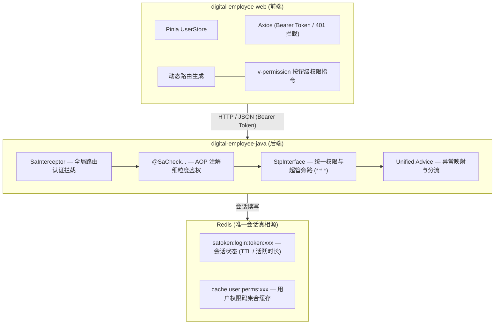
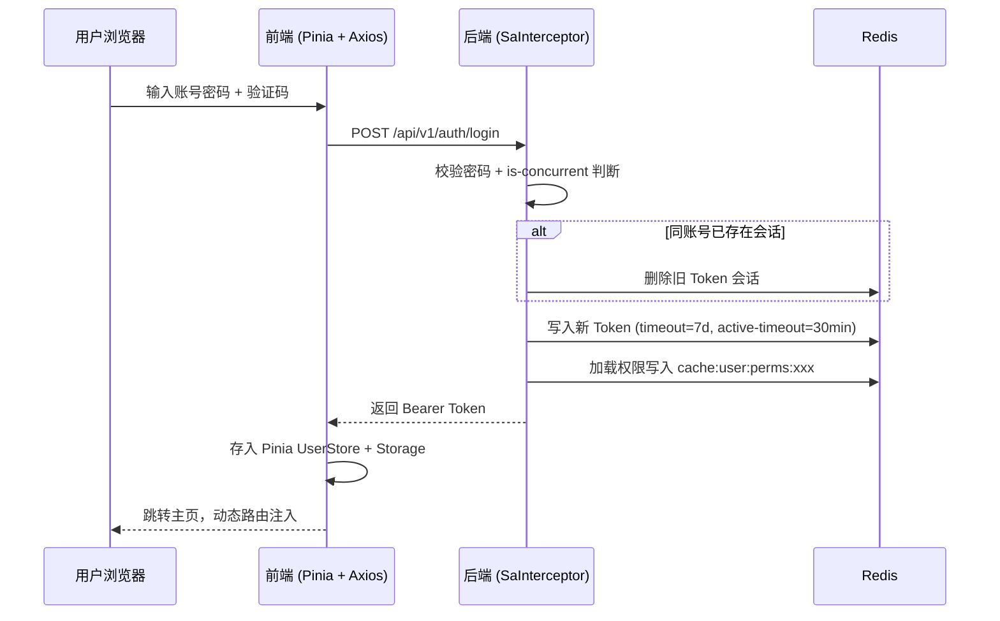
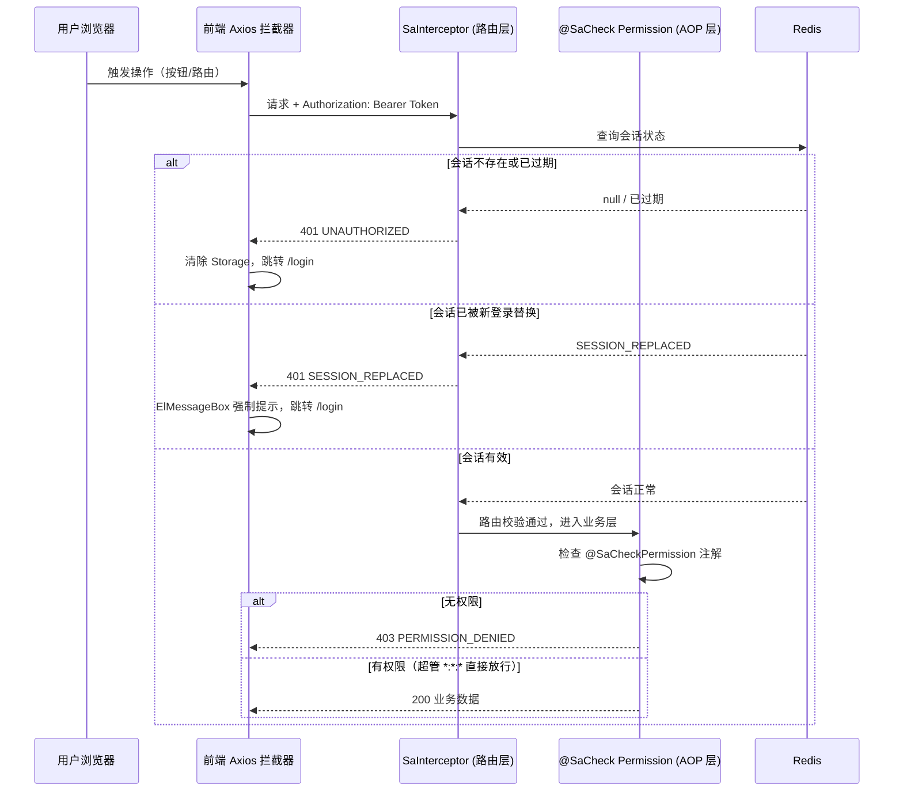
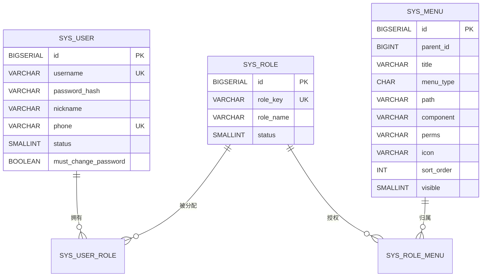

# digital-employee-java 架构开发规范与实施规划

> **项目名称**：`digital-employee-java`（后端单体） + `digital-employee-web`（前端）
> **文档版本**：v2.3
> **生效日期**：2026-09-06
> **基准调整**：全面采纳 **Spring Boot 4.x** 标准生态，适配 `sa-token-spring-boot4-starter` 与 Boot 4 全新依赖体系（`webmvc` 与 `aspectj` 模块切分）。

---

## 1. 架构总览与交互模型

系统采用前后端分离的单体工程架构。认证状态统一由服务端的 Redis 承载（唯一状态源），基于 Sa-Token 的"单 Token 绝对过期 + 活跃超时滑动续约"机制，实现平滑无感续签与精确的"同账号新登录挤掉旧会话"拦截。

### 1.1 架构总览



### 1.2 交互模型

#### 登录认证流程



#### API 请求鉴权流程



> **产品侧已知限制**：Sa-Token 的"被顶下线"检测基于 HTTP 请求拦截机制。浏览器已打开的标签页**不会实时弹出下线提示**，只有在该标签页发起下一次 HTTP 请求时，拦截器捕获到 `SESSION_REPLACED` 后才会弹窗。若需实时推送下线通知，需引入 WebSocket / SSE 全双工通道，当前版本不纳入。

---

## 2. 后端技术规范（`digital-employee-java`）

### 2.1 技术栈与基线选型

* **运行环境**：JDK 17 / 21 / 25
* **核心框架**：Spring Boot **4.0.3+**
* **安全框架**：Sa-Token **1.45.0+**（采用针对 Boot 4 的 `sa-token-spring-boot4-starter` 与 `sa-token-redis-template`）
* **ORM 框架**：MyBatis-Plus **3.5.9+**（适配 Boot 4 / Jakarta 命名空间）
* **密码加密**：Spring Security Crypto `BCryptPasswordEncoder`
* **存储引擎**：PostgreSQL 15+、Redis 6.2+

### 2.2 Maven 核心依赖清单（Spring Boot 4 规范）

> **Boot 4 变化提示**：旧版的 `spring-boot-starter-web` 与 `spring-boot-starter-aop` 已废弃，必须替换为 `spring-boot-starter-webmvc` 与 `spring-boot-starter-aspectj`。

```xml
<parent>
    <groupId>org.springframework.boot</groupId>
    <artifactId>spring-boot-starter-parent</artifactId>
    <version>4.0.3</version>
    <relativePath/>
</parent>

<properties>
    <java.version>17</java.version>
    <sa-token.version>1.45.0</sa-token.version>
    <mybatis-plus.version>3.5.9</mybatis-plus.version>
</properties>

<dependencies>
    <!-- Spring Boot 4 WebMVC (替代原 starter-web) -->
    <dependency>
        <groupId>org.springframework.boot</groupId>
        <artifactId>spring-boot-starter-webmvc</artifactId>
    </dependency>

    <!-- Spring Boot 4 AspectJ (替代原 starter-aop，保证 @SaCheckPermission 注解鉴权生效) -->
    <dependency>
        <groupId>org.springframework.boot</groupId>
        <artifactId>spring-boot-starter-aspectj</artifactId>
    </dependency>

    <!-- Sa-Token Spring Boot 4 专用 Starter -->
    <dependency>
        <groupId>cn.dev33</groupId>
        <artifactId>sa-token-spring-boot4-starter</artifactId>
        <version>${sa-token.version}</version>
    </dependency>

    <!-- Sa-Token RedisTemplate 持久化集成 -->
    <dependency>
        <groupId>cn.dev33</groupId>
        <artifactId>sa-token-redis-template</artifactId>
        <version>${sa-token.version}</version>
    </dependency>

    <!-- Redis 连接池 -->
    <dependency>
        <groupId>org.apache.commons</groupId>
        <artifactId>commons-pool2</artifactId>
    </dependency>

    <!-- MyBatis-Plus (适配 Boot 4 / Jakarta) -->
    <dependency>
        <groupId>com.baomidou</groupId>
        <artifactId>mybatis-plus-spring-boot4-starter</artifactId>
        <version>${mybatis-plus.version}</version>
    </dependency>

    <!-- PostgreSQL 驱动 -->
    <dependency>
        <groupId>org.postgresql</groupId>
        <artifactId>postgresql</artifactId>
        <scope>runtime</scope>
    </dependency>

    <!-- Spring Security Crypto (BCryptPasswordEncoder) -->
    <dependency>
        <groupId>org.springframework.security</groupId>
        <artifactId>spring-security-crypto</artifactId>
    </dependency>

    <!-- 编译期配置元数据处理器 -->
    <dependency>
        <groupId>org.springframework.boot</groupId>
        <artifactId>spring-boot-configuration-processor</artifactId>
        <optional>true</optional>
    </dependency>
</dependencies>
```

### 2.3 Sa-Token 配置 (`application.yml`)

```yaml
sa-token:
  token-name: Authorization
  token-prefix: Bearer
  timeout: 604800         # 绝对过期：7 天无条件失效（秒）
  active-timeout: 1800    # 活跃超时：30 分钟无操作自动冻结退出（秒）
  is-concurrent: false    # 严格单会话：同账号新登录顶掉旧登录
  is-share: false         # 每次登录更新独立的 Token
  token-style: random-64  # 64 位高熵随机串 (opaque token)
  is-read-cookie: false   # 纯 Token 模式，关闭 Cookie 读取
  is-log: false           # 生产关闭冗余日志
```

> **产品侧约束**：`is-concurrent: false` 意味着同一账号在新终端登录后，旧终端的其他浏览器标签页将在下一次请求时被强制踢下线。产品与测试团队需提前知晓此行为，避免误报为缺陷。

### 2.4 后端核心代码落地

**1. 统一信封 (`Result.java`)**

```java
package com.digital.employee.common.core;

import lombok.Data;

@Data
public class Result<T> {
    private String code;
    private String message;
    private T data;

    public static <T> Result<T> success(T data) {
        Result<T> r = new Result<>();
        r.code = "OK";
        r.message = "success";
        r.data = data;
        return r;
    }

    public static <T> Result<T> success() {
        return success(null);
    }

    public static <T> Result<T> fail(String code, String message) {
        Result<T> r = new Result<>();
        r.code = code;
        r.message = message;
        return r;
    }
}
```

**2. CORS 跨域配置 (`CorsConfigure.java`)**

```java
package com.digital.employee.system.config;

import org.springframework.context.annotation.Bean;
import org.springframework.context.annotation.Configuration;
import org.springframework.web.cors.CorsConfiguration;
import org.springframework.web.cors.UrlBasedCorsConfigurationSource;
import org.springframework.web.filter.CorsFilter;

import java.util.List;

@Configuration
public class CorsConfigure {

    @Bean
    public CorsFilter corsFilter() {
        CorsConfiguration config = new CorsConfiguration();
        config.setAllowedOriginPatterns(List.of("http://localhost:*", "https://your-domain.com"));
        config.setAllowedMethods(List.of("GET", "POST", "PUT", "DELETE", "OPTIONS"));
        config.setAllowedHeaders(List.of("*"));
        config.setAllowCredentials(true);
        config.setMaxAge(3600L);

        UrlBasedCorsConfigurationSource source = new UrlBasedCorsConfigurationSource();
        source.registerCorsConfiguration("/**", config);
        return new CorsFilter(source);
    }
}
```

**3. 拦截器路由配置 (`SaTokenConfigure.java`)**

分工明确：拦截器负责"要不要登录"，AOP 注解负责"有没有权限"。

```java
package com.digital.employee.system.config;

import cn.dev33.satoken.interceptor.SaInterceptor;
import cn.dev33.satoken.router.SaRouter;
import cn.dev33.satoken.stp.StpUtil;
import org.springframework.context.annotation.Configuration;
import org.springframework.web.servlet.config.annotation.InterceptorRegistry;
import org.springframework.web.servlet.config.annotation.WebMvcConfigurer;

@Configuration
public class SaTokenConfigure implements WebMvcConfigurer {
    @Override
    public void addInterceptors(InterceptorRegistry registry) {
        registry.addInterceptor(new SaInterceptor(handle -> {
            SaRouter.match("/api/**")
                    .notMatch(
                        "/api/v1/auth/login",
                        "/api/v1/auth/captcha",
                        "/api/v1/health"
                    )
                    .check(r -> StpUtil.checkLogin());
        })).addPathPatterns("/**");
    }
}
```

> **接口版本管理约束**：当前统一使用 `/api/v1/**` 前缀。未来引入 v2 版本时，在 `SaRouter` 中追加 `/api/v2/**` 匹配规则；旧版本接口保持兼容，新功能仅在 v2 路径下开发，直至 v1 下线。

**4. 权限数据源与超管旁路 — 含缓存读取 (`StpInterfaceImpl.java`)**

严禁直接将 `loginId` 强转为 `Long`（Redis 反序列化底层通常为 String）；通过返回 `*:*:*` 统一旁路 `super_admin`。权限数据通过 Redis 缓存加速读取，采用 **Cache-Aside** 模式：

```java
package com.digital.employee.system.satoken;

import cn.dev33.satoken.stp.StpInterface;
import com.digital.employee.system.service.SysMenuService;
import com.digital.employee.system.service.SysRoleService;
import org.springframework.data.redis.core.StringRedisTemplate;
import org.springframework.stereotype.Component;
import java.util.List;
import java.util.concurrent.TimeUnit;

@Component
public class StpInterfaceImpl implements StpInterface {

    private static final String PERM_CACHE_PREFIX = "cache:user:perms:";
    private static final long PERM_CACHE_TTL_HOURS = 24;

    private final SysMenuService menuService;
    private final SysRoleService roleService;
    private final StringRedisTemplate redisTemplate;

    public StpInterfaceImpl(SysMenuService menuService, SysRoleService roleService,
                            StringRedisTemplate redisTemplate) {
        this.menuService = menuService;
        this.roleService = roleService;
        this.redisTemplate = redisTemplate;
    }

    @Override
    public List<String> getPermissionList(Object loginId, String loginType) {
        Long userId = Long.valueOf(loginId.toString());
        List<String> roles = getRoleList(loginId, loginType);

        if (roles.contains("super_admin")) {
            return List.of("*:*:*");
        }

        String cacheKey = PERM_CACHE_PREFIX + userId;
        List<String> cached = redisTemplate.opsForList().range(cacheKey, 0, -1);
        if (cached != null && !cached.isEmpty()) {
            return cached;
        }

        List<String> perms = menuService.listPermsByUserId(userId);
        if (!perms.isEmpty()) {
            redisTemplate.opsForList().leftPushAll(cacheKey, perms);
            redisTemplate.expire(cacheKey, PERM_CACHE_TTL_HOURS, TimeUnit.HOURS);
        }
        return perms;
    }

    @Override
    public List<String> getRoleList(Object loginId, String loginType) {
        Long userId = Long.valueOf(loginId.toString());
        return roleService.listRoleKeysByUserId(userId);
    }

    public void clearPermCache(Long userId) {
        redisTemplate.delete(PERM_CACHE_PREFIX + userId);
    }
}
```

**5. 权限缓存维护规则**

采用 **Cache-Aside（旁路缓存）** 模式，确保权限变更后缓存一致性：

| 触发时机 | 操作 | 说明 |
| :--- | :--- | :--- |
| 用户登录 | 写入 `cache:user:perms:{userId}` | 登录时加载权限集合并缓存 |
| 用户登出 / 被挤下线 | 删除 `cache:user:perms:{userId}` | 清理无效缓存 |
| 修改用户角色分配 | 删除 `cache:user:perms:{userId}` | 角色变更影响权限 |
| 修改角色菜单权限 | 批量删除相关用户缓存 | 需反查受影响的用户列表 |
| 兜底 TTL | 24 小时自动过期 | 防止极端场景下缓存脏数据永久残留 |

**6. 全局异常细分映射 (`GlobalExceptionHandler.java`)**

将常规过期（`UNAUTHORIZED`）与被挤下线（`SESSION_REPLACED`）区分响应，便于前端针对性展示提示：

```java
package com.digital.employee.common.exception;

import cn.dev33.satoken.exception.NotLoginException;
import cn.dev33.satoken.exception.NotPermissionException;
import com.digital.employee.common.core.Result;
import org.springframework.http.HttpStatus;
import org.springframework.http.ResponseEntity;
import org.springframework.web.bind.annotation.ExceptionHandler;
import org.springframework.web.bind.annotation.RestControllerAdvice;

@RestControllerAdvice
public class GlobalExceptionHandler {

    @ExceptionHandler(NotLoginException.class)
    public ResponseEntity<Result<Void>> handleNotLogin(NotLoginException e) {
        if (NotLoginException.BE_REPLACED.equals(e.getType())) {
            return ResponseEntity.status(HttpStatus.UNAUTHORIZED)
                    .body(Result.fail("SESSION_REPLACED", "您的账号已在其他终端登录，当前会话已失效"));
        }
        return ResponseEntity.status(HttpStatus.UNAUTHORIZED)
                .body(Result.fail("UNAUTHORIZED", "登录状态已过期，请重新登录"));
    }

    @ExceptionHandler(NotPermissionException.class)
    public ResponseEntity<Result<Void>> handleNotPermission(NotPermissionException e) {
        return ResponseEntity.status(HttpStatus.FORBIDDEN)
                .body(Result.fail("PERMISSION_DENIED", "暂无操作权限"));
    }
}
```

**7. 密码安全规范**

```java
package com.digital.employee.common.utils;

import org.springframework.security.crypto.bcrypt.BCryptPasswordEncoder;

public final class PasswordEncoder {

    private static final BCryptPasswordEncoder ENCODER = new BCryptPasswordEncoder();

    private PasswordEncoder() {}

    public static String encode(String rawPassword) {
        return ENCODER.encode(rawPassword);
    }

    public static boolean matches(String rawPassword, String passwordHash) {
        return ENCODER.matches(rawPassword, passwordHash);
    }
}
```

**密码策略约束**：

* 存储：统一使用 BCrypt 加密，禁止明文或 MD5/SHA1。
* 复杂度：密码长度 ≥ 8 位，需包含大写字母、小写字母、数字中的至少两类。
* 防暴力破解：登录接口采用 `IP + 账号` 维度限流，连续 5 次失败后锁定 15 分钟。

### 2.5 后端工程目录结构

采用聚合单体工程规范划分模块：

```text
digital-employee-java/                        # 父工程 POM
├── pom.xml
├── common/                                   # 基础设施下沉
│   └── src/main/java/com/digital/employee/common/
│       ├── core/                             # 统一信封 Result<T>、枚举、常量
│       ├── exception/                        # GlobalExceptionHandler 与自定义异常
│       ├── redis/                            # Redis 配置与工具类
│       └── utils/                            # 加密、脱敏、上下文工具
├── system/                                   # RBAC 权限与系统核心
│   └── src/main/java/com/digital/employee/system/
│       ├── config/                           # SaTokenConfigure, CorsConfigure
│       ├── satoken/                          # StpInterfaceImpl
│       ├── domain/                           # 实体 (SysUser, SysRole, SysMenu) 与 DTO/VO
│       ├── mapper/                           # MyBatis-Plus 数据仓储
│       ├── service/                          # 用户、角色、菜单管理服务
│       └── controller/                       # AuthController, UserController 等
├── business/                                 # 核心业务模块
│   └── src/main/java/com/digital/employee/business/
│       ├── agent/                            # AI 运行时
│       └── bot/                              # Bot 配置管理
└── app/                                      # 启动与集成模块
    └── src/main/
        ├── java/com/digital/employee/
        │   └── Application.java              # 唯一 Spring Boot 启动类
        └── resources/
            ├── application.yml               # 通用配置
            ├── application-dev.yml           # 开发环境配置
            ├── application-prod.yml          # 生产环境配置
            └── db/migration/                 # PostgreSQL 脚本 (Flyway)
```

---

## 3. RBAC 数据模型（单轨 5 表模型）

将页面路由、菜单展示与后端接口权限统一收敛到 `sys_menu` 表，角色分配时只需勾选单一菜单树，避免配置脱节。

### 3.1 DDL 设计（PostgreSQL 规范）

```sql
-- 1. 用户表
CREATE TABLE sys_user (
    id BIGSERIAL PRIMARY KEY,
    username VARCHAR(64) NOT NULL UNIQUE,
    password_hash VARCHAR(255) NOT NULL,
    nickname VARCHAR(64),
    phone VARCHAR(20) UNIQUE,
    status SMALLINT NOT NULL DEFAULT 1,         -- 1=正常, 0=禁用
    must_change_password BOOLEAN NOT NULL DEFAULT FALSE,
    created_at TIMESTAMP WITH TIME ZONE NOT NULL DEFAULT CURRENT_TIMESTAMP,
    updated_at TIMESTAMP WITH TIME ZONE NOT NULL DEFAULT CURRENT_TIMESTAMP
);
CREATE INDEX idx_sys_user_status ON sys_user(status);
CREATE INDEX idx_sys_user_phone ON sys_user(phone);

-- 2. 角色表
CREATE TABLE sys_role (
    id BIGSERIAL PRIMARY KEY,
    role_key VARCHAR(64) NOT NULL UNIQUE,       -- super_admin / manager / user
    role_name VARCHAR(64) NOT NULL,
    status SMALLINT NOT NULL DEFAULT 1,
    created_at TIMESTAMP WITH TIME ZONE NOT NULL DEFAULT CURRENT_TIMESTAMP
);

-- 3. 菜单与权限统一表 (承载目录、路由页面、按钮与接口操作)
CREATE TABLE sys_menu (
    id BIGSERIAL PRIMARY KEY,
    parent_id BIGINT NOT NULL DEFAULT 0,
    title VARCHAR(64) NOT NULL,
    menu_type CHAR(1) NOT NULL,                 -- M=目录, C=菜单页面, F=按钮与操作
    path VARCHAR(128),                          -- 前端路由 (仅 M/C)
    component VARCHAR(128),                     -- 组件路径 (仅 C)
    perms VARCHAR(128),                         -- 权限标识 (如 admin:user:manage)
    icon VARCHAR(64),
    sort_order INT NOT NULL DEFAULT 0,
    visible SMALLINT NOT NULL DEFAULT 1,        -- 1=显示, 0=隐藏
    created_at TIMESTAMP WITH TIME ZONE NOT NULL DEFAULT CURRENT_TIMESTAMP
);
CREATE INDEX idx_sys_menu_parent ON sys_menu(parent_id);
CREATE INDEX idx_sys_menu_perms ON sys_menu(perms);

-- 4. 用户-角色关联表
CREATE TABLE sys_user_role (
    user_id BIGINT NOT NULL REFERENCES sys_user(id) ON DELETE CASCADE,
    role_id BIGINT NOT NULL REFERENCES sys_role(id) ON DELETE CASCADE,
    PRIMARY KEY (user_id, role_id)
);
CREATE INDEX idx_user_role_rid ON sys_user_role(role_id);

-- 5. 角色-菜单关联表
CREATE TABLE sys_role_menu (
    role_id BIGINT NOT NULL REFERENCES sys_role(id) ON DELETE CASCADE,
    menu_id BIGINT NOT NULL REFERENCES sys_menu(id) ON DELETE CASCADE,
    PRIMARY KEY (role_id, menu_id)
);
CREATE INDEX idx_role_menu_mid ON sys_role_menu(menu_id);
```

### 3.2 RBAC 数据模型 ER 关系



### 3.3 预置权限标识清单（16 核心权限码）

| 权限码 | 说明 |
| :--- | :--- |
| `admin:user:manage` | 用户管理（增删改） |
| `admin:user:readonly` | 用户查看 |
| `admin:permission:manage` | 权限管理（增删改） |
| `admin:permission:readonly` | 权限查看 |
| `admin:invite_code:manage` | 邀请码管理 |
| `admin:invite_code:readonly` | 邀请码查看 |
| `admin:menu:manage` | 菜单管理 |
| `admin:menu:readonly` | 菜单查看 |
| `admin:data_platform:dashboard` | 数据平台仪表盘 |
| `admin:data_platform:data_items` | 数据平台数据项 |
| `admin:data_platform:config` | 数据平台配置 |
| `admin:bot:manage` | Bot 管理 |
| `admin:bot:readonly` | Bot 查看 |
| `admin:agent:manage` | Agent 管理 |
| `admin:agent:readonly` | Agent 查看 |
| `admin:observability:log:view` | 可观测性日志查看 |

### 3.4 初始化 SQL 脚本

```sql
-- 初始角色
INSERT INTO sys_role (role_key, role_name, status)
VALUES
    ('super_admin', '超级管理员', 1),
    ('admin', '管理员', 1),
    ('user', '普通用户', 1);

-- 初始管理员用户 (密码: Admin@123456, BCrypt 加密)
INSERT INTO sys_user (username, password_hash, nickname, status)
VALUES ('admin', '$2a$10$N.zmdr9k7uOCQb376NoUnuTJ8iAt6Z5EHsM8lE9lBOsl7iKTVKIUi', '超级管理员', 1);

-- admin 用户分配 super_admin 角色
INSERT INTO sys_user_role (user_id, role_id)
VALUES (1, (SELECT id FROM sys_role WHERE role_key = 'super_admin'));

-- 初始菜单与权限 (示例：系统管理目录 + 用户管理页面 + 用户管理权限码)
INSERT INTO sys_menu (id, parent_id, title, menu_type, path, component, perms, icon, sort_order)
VALUES
    (1, 0, '系统管理', 'M', '/system', NULL, NULL, 'setting', 1),
    (2, 1, '用户管理', 'C', '/system/user', 'system/user/UserManage', 'admin:user:readonly', 'user', 1),
    (3, 2, '用户新增', 'F', NULL, NULL, 'admin:user:manage', NULL, 1),
    (4, 2, '用户编辑', 'F', NULL, NULL, 'admin:user:manage', NULL, 2),
    (5, 2, '用户删除', 'F', NULL, NULL, 'admin:user:manage', NULL, 3);

-- super_admin 角色拥有全部菜单权限
INSERT INTO sys_role_menu (role_id, menu_id)
SELECT (SELECT id FROM sys_role WHERE role_key = 'super_admin'), id FROM sys_menu;
```

---

## 4. 前端开发规范（`digital-employee-web`）

严格遵循 `frontend-spec` 前端规范：使用 TS 全量类型推导、禁用 `any`、组件采用大驼峰命名、工具与目录采用短横线、样式符合 BEM 且嵌套不超 3 层。

### 4.1 前端工程目录树 (`src/`)

```text
src/
├── api/                             # 接口定义（kebab-case）
│   ├── types.ts                     # 统一信封接口与领域模型
│   ├── auth-api.ts                  # 登录、登出、/me 获取资料
│   └── system-api.ts                # 用户、角色、菜单树接口
├── assets/                          # 静态资源
├── components/                      # 公共组件（PascalCase）
│   ├── CaptchaInput.vue             # 算术验证码组件
│   └── TablePagination.vue          # 分页展示组件
├── composables/                     # 业务复用组合式函数
│   ├── use-auth.ts                  # 认证生命周期管理
│   └── use-table.ts                 # 表格查询与防抖封装
├── constants/                       # 全局常量（全大写下划线）
│   ├── access-codes.ts              # 16 个权限标识常量
│   └── app-keys.ts                  # Storage Key 与路由白名单
├── directives/                      # 自定义指令
│   └── permission.ts                # v-permission 权限指令
├── layouts/                         # 基础骨架（PascalCase）
│   ├── MainLayout.vue               # 主容器入口
│   └── components/
│       ├── SideBar.vue              # 动态侧边栏
│       └── TopNavbar.vue            # 顶部导航操作栏
├── router/                          # 路由配置
│   ├── index.ts                     # 静态路由（/login, /404）
│   └── guard.ts                     # 全局 beforeEach 守卫与 addRoute 注入
├── store/                           # 状态管理（Pinia）
│   ├── index.ts
│   └── modules/
│       ├── user.ts                  # 用户凭据、Token、权限集合
│       └── permission.ts            # 动态菜单树解析与生成
├── styles/                          # SCSS 全局样式
│   ├── index.scss
│   └── variables.scss               # 布局与色彩变量
├── utils/                           # 通用工具函数
│   ├── request.ts                   # Axios 拦截器与 401 登出
│   └── storage.ts                   # Storage 统一安全封装
└── views/                           # 页面视图（kebab-case 目录 + PascalCase 组件）
    ├── auth/
    │   └── LoginView.vue
    ├── dashboard/
    │   └── DashboardView.vue
    └── system/
        ├── user/
        │   └── UserManage.vue
        └── role/
            └── RoleManage.vue
```

### 4.2 前端核心实现

**1. Axios 封装与被顶下线阻断 (`src/utils/request.ts`)**

```typescript
import axios, { type AxiosResponse, type InternalAxiosRequestConfig } from 'axios';
import { ElMessage, ElMessageBox } from 'element-plus';
import type { IApiResponse } from '@/api/types';
import { getStorage, clearStorage } from '@/utils/storage';
import { STORAGE_KEYS } from '@/constants/app-keys';

const HTTP_STATUS = {
  UNAUTHORIZED: 401,
  FORBIDDEN: 403,
} as const;

const request = axios.create({
  baseURL: import.meta.env.VITE_API_BASE_URL || '/api/v1',
  timeout: 10000,
});

request.interceptors.request.use((config: InternalAxiosRequestConfig) => {
  const token = getStorage<string>(STORAGE_KEYS.ACCESS_TOKEN);
  if (token && config.headers) {
    config.headers.Authorization = `Bearer ${token}`;
  }
  return config;
});

request.interceptors.response.use(
  (response: AxiosResponse<IApiResponse>) => {
    const { data } = response;
    if (data && data.code !== 'OK') {
      ElMessage.error(data.message || '请求失败');
      return Promise.reject(new Error(data.message));
    }
    return data;
  },
  (error) => {
    const { response } = error;
    if (response) {
      const { status, data } = response;
      if (status === HTTP_STATUS.UNAUTHORIZED) {
        if (data?.code === 'SESSION_REPLACED') {
          ElMessageBox.alert('您的账号已在其他终端登录，当前会话已失效。', '下线提示', {
            confirmButtonText: '重新登录',
            type: 'warning',
            callback: () => {
              clearStorage();
              window.location.href = '/login';
            },
          });
        } else {
          ElMessage.error(data?.message || '登录已失效，请重新登录');
          clearStorage();
          window.location.href = '/login';
        }
      } else if (status === HTTP_STATUS.FORBIDDEN) {
        ElMessage.error(data?.message || '暂无操作权限');
      } else {
        ElMessage.error(data?.message || '网络连接异常');
      }
    }
    return Promise.reject(error);
  }
);

export default request;
```

**2. 按钮级权限自定义指令 (`src/directives/permission.ts`)**

支持通配符 `*:*:*` 自动跳过，无权限节点在挂载时直接从 DOM 树移除：

```typescript
import type { App, DirectiveBinding } from 'vue';
import { useUserStore } from '@/store/modules/user';

const SUPER_ADMIN_PERM = '*:*:*';

export const setupPermissionDirective = (app: App): void => {
  app.directive('permission', {
    mounted(el: HTMLElement, binding: DirectiveBinding<string | string[]>) {
      const { value } = binding;
      const userStore = useUserStore();
      const permissions = userStore.permissions;

      if (!value) {
        throw new Error('v-permission 必须绑定权限标识码');
      }

      // 超管通配符全量放行
      if (permissions.includes(SUPER_ADMIN_PERM)) {
        return;
      }

      const requiredPerms = Array.isArray(value) ? value : [value];
      const hasPermission = requiredPerms.some((perm) => permissions.includes(perm));

      if (!hasPermission && el.parentNode) {
        el.parentNode.removeChild(el);
      }
    },
  });
};
```

> **`v-permission` 局限性**：当前指令仅在组件 `mounted` 阶段执行 DOM 校验。运行时权限动态变更（如管理员在后台修改角色后）已挂载的按钮**不会自动刷新**。常规解法：权限变更后调用 `window.location.reload()` 强制刷新页面，或通过 Vue `key` 强制重建组件。

### 4.3 `/api/v1/auth/me` 接口契约

登录成功后前端调用此接口获取当前用户信息、角色与权限集合，用于动态路由生成与按钮级鉴权。

**请求**

```
GET /api/v1/auth/me
Authorization: Bearer <token>
```

**响应**

```json
{
  "code": "OK",
  "message": "success",
  "data": {
    "userId": 1,
    "username": "admin",
    "nickname": "超级管理员",
    "roles": ["super_admin"],
    "permissions": ["*:*:*"],
    "menus": [
      {
        "id": 1,
        "parentId": 0,
        "title": "系统管理",
        "menuType": "M",
        "path": "/system",
        "icon": "setting",
        "children": [
          {
            "id": 2,
            "parentId": 1,
            "title": "用户管理",
            "menuType": "C",
            "path": "/system/user",
            "component": "system/user/UserManage",
            "icon": "user",
            "permissions": ["admin:user:readonly", "admin:user:manage"],
            "children": []
          }
        ]
      }
    ]
  }
}
```

前端 `permission.ts` Store 解析 `menus` 递归生成路由，`permissions` 数组供 `v-permission` 指令与 `use-auth.ts` 使用。

---

## 5. 项目分阶段实施与交付计划

| 阶段 | 核心目标 | 交付物 |
| :--- | :--- | :--- |
| **Phase 0** | 基础工程与环境基线就绪 | Spring Boot 4.0.3 POM 依赖调通、5 张表 DDL 执行脚本、预置初始角色与权限码、`application-dev.yml` / `application-prod.yml` 环境配置模板 |
| **Phase 1** | 后端鉴权闭环 | `SaTokenConfigure`、`CorsConfigure`、`StpInterfaceImpl`（含缓存读写）组装完成，`@SaCheckPermission` 与全局异常映射单元测试通过，BCrypt 密码工具就绪 |
| **Phase 2** | 系统管理 CRUD | 用户管理、角色菜单分配接口与 `/api/v1/auth/me`（动态菜单树 + 权限集合）完成开发并验证，权限缓存失效联动测试 |
| **Phase 3** | 前端骨架与动态路由 | Vite 初始化、Axios 拦截器（含业务错误码处理）、Pinia 模块、动态路由追加逻辑以及 `v-permission` 调试 |
| **Phase 4** | 系统联调与安全加固 | 单会话多标签页被踢联动测试、登录限流防暴力破解、接口压测与联调上线 |

### 环境与规范约束

| 类别 | 规范 |
| :--- | :--- |
| **环境配置** | 三套配置文件：`application-dev.yml`（本地开发）、`application-test.yml`（测试）、`application-prod.yml`（生产），敏感配置走环境变量注入 |
| **单元测试** | 鉴权链路（`StpInterfaceImpl`、异常映射）须覆盖，覆盖率 ≥ 70% |
| **集成测试** | Phase 2 完成后，对 `/api/v1/auth/me`、角色菜单分配联动做端到端验证 |
| **日志规范** | 生产环境 `sa-token.is-log: false`；业务日志使用 SLF4J + Logback，禁止 `System.out`；登录行为（成功/失败/被踢）须记录审计日志 |
| **Redis Key 规范** | 所有 Redis Key 统一设置 TTL，禁止永久 Key；会话 Key 由 Sa-Token 管理，业务缓存 Key 前缀统一为 `cache:user:perms:{userId}` |

---

## 6. 已知限制与产品约束

| 项目 | 说明 | 影响范围 |
| :--- | :--- | :--- |
| **被踢下线延迟感知** | Sa-Token 基于 HTTP 请求拦截检测会话状态，已打开的浏览器标签页不会实时弹窗。只有用户在被踢后发起下一次请求时，才触发 401 `SESSION_REPLACED` 弹窗提示 | 产品体验 |
| **`v-permission` 不支持运行时热切** | 自定义指令仅在 `mounted` 阶段执行，权限变更后不会自动刷新 DOM。需要刷新页面或强制重建组件才生效 | 权限变更场景 |
| **MyBatis-Plus Boot 4 适配** | Boot 4 为极新版本，需确认 MyBatis-Plus 官方 `mybatis-plus-spring-boot4-starter` 对 Jakarta 命名空间的完整支持，建议锁定稳定版 | 构建与启动 |
| **CORS 白名单** | `CorsConfigure` 中的 `allowedOriginPatterns` 需在部署时根据实际域名修改，开发环境使用 `localhost:*` | 部署配置 |
