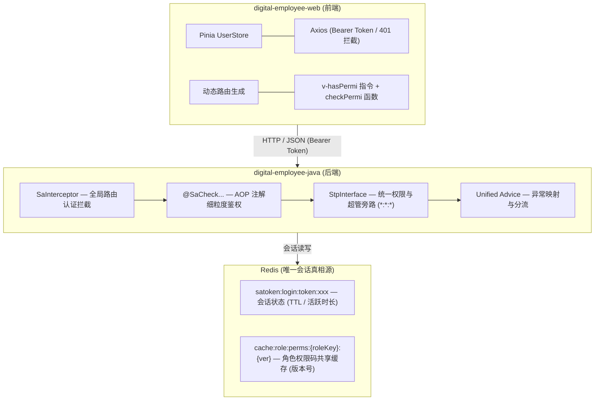
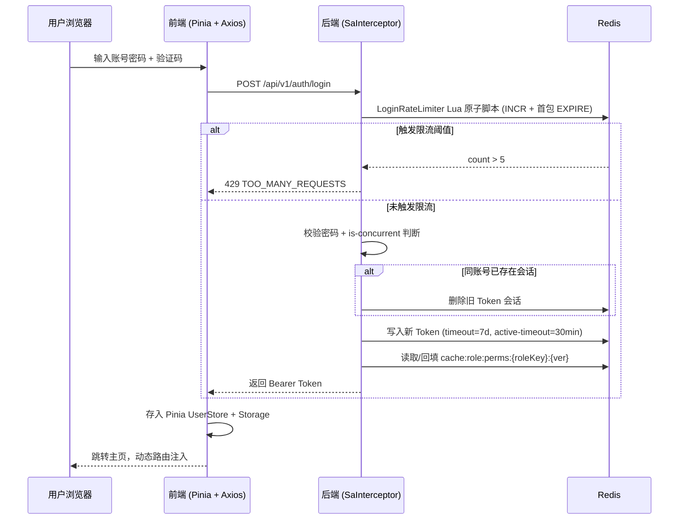
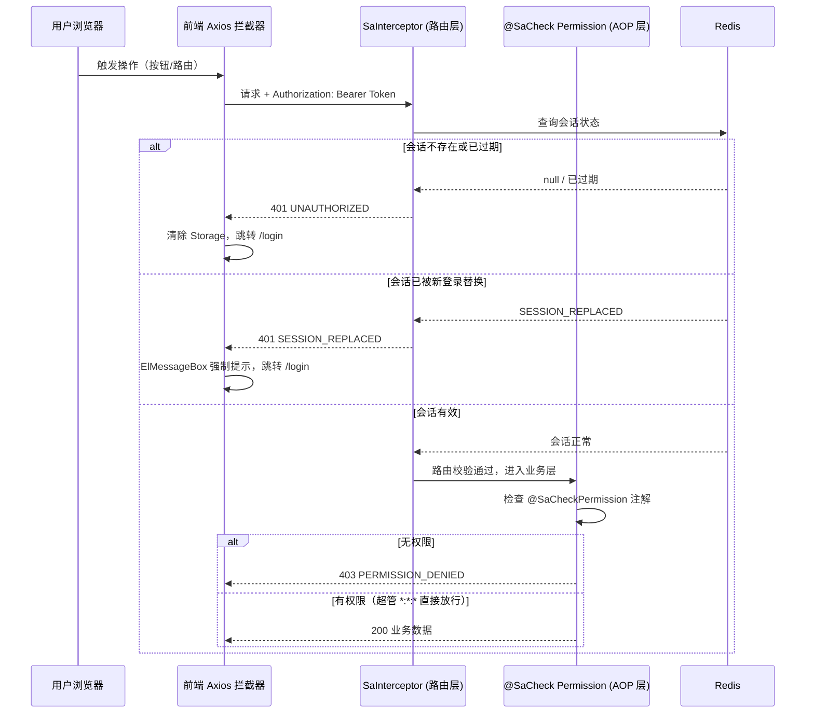
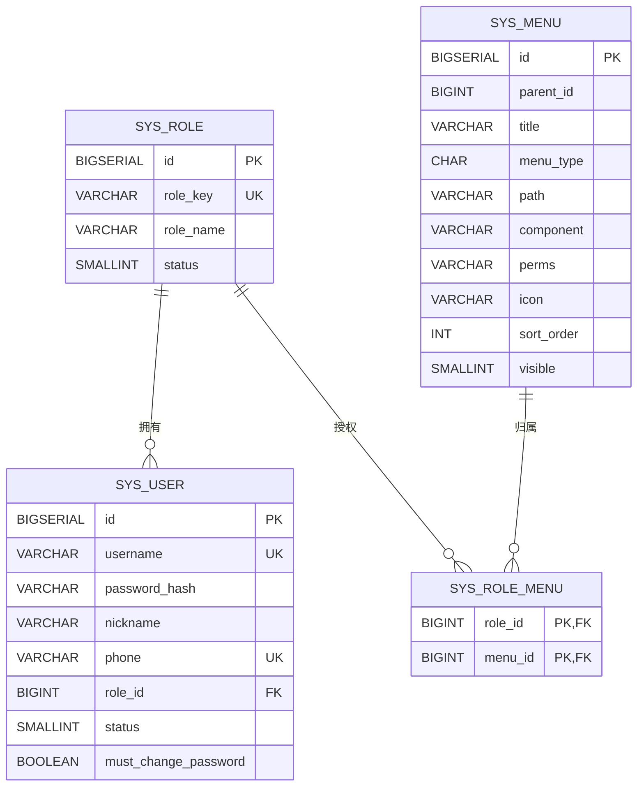

# digital-employee-java 架构开发规范与实施规划

> **项目名称**：`digital-employee-java`（后端单体） + `digital-employee-web`（前端）
> **文档版本**：v2.7
> **生效日期**：2026-09-06
> **基准调整**：全面采纳 **Spring Boot 4.x** 标准生态，适配 `sa-token-spring-boot4-starter` 与 Boot 4 全新依赖体系（`webmvc` 与 `aspectj` 模块切分）。业务模型收敛为**"用户仅绑定单角色"的 RBAC 核心 4 表模型**（废弃 `sys_user_role` 关联表，`role_id` 直接内嵌 `sys_user`），权限缓存升级为**角色维度共享缓存 + 带所有权校验的 Redis 互斥锁防击穿**（`cache:role:perms:{roleKey}:{ver}`），登录限流采用 **Lua 原子脚本**保证计数与 TTL 原子执行，`role_key` 列增加 PostgreSQL CHECK 约束防止 Redis 命名空间冒号污染。

---

## 1. 架构总览与交互模型

系统采用前后端分离的单体工程架构。认证状态统一由服务端的 Redis 承载（唯一状态源），基于 Sa-Token 的"单 Token 绝对过期 + 活跃超时滑动续约"机制，实现平滑无感续签与精确的"同账号新登录挤掉旧会话"拦截。

### 1.1 架构总览



### 1.2 交互模型

#### 登录认证流程



#### API 请求鉴权流程



> **产品侧已知限制**：Sa-Token 的"被顶下线"检测基于 HTTP 请求拦截机制。浏览器已打开的标签页**不会实时弹出下线提示**，只有在该标签页发起下一次 HTTP 请求时，拦截器捕获到 `SESSION_REPLACED` 后才会弹窗。若需实时推送下线通知，需引入 WebSocket / SSE 全双工通道，当前版本不纳入。

---

## 2. 后端技术规范（`digital-employee-java`）

### 2.1 技术栈与基线选型

* **运行环境**：JDK **21**
* **核心框架**：Spring Boot **4.1.0**（参考官方 Boot 4 示范工程 POM 确认的基线版本）
* **安全框架**：Sa-Token **1.45.0**（采用针对 Boot 4 的 `sa-token-spring-boot4-starter` 与 `sa-token-redis-template`）
* **ORM 框架**：MyBatis-Plus **3.5.16**（自 **3.5.13** 起已适配 Boot 4，须使用 `mybatis-plus-spring-boot4-starter`，适配 Jakarta 命名空间）
* **连接池**：HikariCP（Spring Boot 默认，零配置引入，性能优于 Druid；**不引入 Druid**，保持依赖树精简）
* **代码生成**：Lombok **1.18.38**（适配高版本 JDK，编译期注解处理走 `maven-compiler-plugin` 的 `annotationProcessorPaths`）
* **API 文档注解**：`swagger-annotations-jakarta` **2.2.47**（采用 Jakarta 命名空间注解，不引入完整 springdoc 运行时依赖）
* **密码加密**：Spring Security Crypto `BCryptPasswordEncoder`
* **存储引擎**：PostgreSQL 15+（JDBC Driver 42.7.x，由 Boot BOM 管理）、Redis 6.2+

### 2.2 Maven 核心依赖清单（Spring Boot 4 规范）

> **Boot 4 变化提示**：Boot 4 使用 `spring-boot-starter-webmvc` 提供 MVC Web 能力；AOP 使用 `spring-boot-starter-aspectj`。项目采用 Spring AOP 代理机制，不依赖 AspectJ 编译期织入。

#### 版本管理（properties）

| 属性 | 版本 | 说明 |
| :--- | :--- | :--- |
| `java.version` | 21 | JDK 固定 21，LTS 版本 |
| `sa-token.version` | 1.45.0 | Sa-Token 核心 + Redis 集成，统一版本锁定 |
| `mybatis-plus.version` | 3.5.16 | MyBatis-Plus Boot 4 适配版（自 3.5.13 起支持 Boot 4，参考 POM 实测版本） |
| `lombok.version` | 1.18.38 | Lombok 高版本 JDK 适配版，编译期注解处理 |
| `swagger-annotations.version` | 2.2.47 | OpenAPI 注解 Jakarta 命名空间版 |

#### 依赖清单

```xml
<parent>
    <groupId>org.springframework.boot</groupId>
    <artifactId>spring-boot-starter-parent</artifactId>
    <version>4.1.0</version>
    <relativePath/>
</parent>

<groupId>com.digital.employee</groupId>
<artifactId>digital-employee-java</artifactId>
<version>1.0.0-SNAPSHOT</version>
<packaging>pom</packaging>
<name>digital-employee-java</name>
<description>数字员工后端系统：Spring Boot 4 + Sa-Token + MyBatis-Plus</description>

<!-- 聚合模块 -->
<modules>
    <module>common</module>
    <module>system</module>
    <module>business</module>
    <module>app</module>
</modules>

<properties>
    <java.version>21</java.version>
    <sa-token.version>1.45.0</sa-token.version>
    <mybatis-plus.version>3.5.16</mybatis-plus.version>
    <lombok.version>1.18.38</lombok.version>
    <swagger-annotations.version>2.2.47</swagger-annotations.version>
</properties>

<dependencyManagement>
    <dependencies>
        <!-- 内部模块版本管理（子模块依赖父 POM 统一版本，不写 <version>） -->
        <dependency>
            <groupId>com.digital.employee</groupId>
            <artifactId>common</artifactId>
            <version>${project.version}</version>
        </dependency>
        <dependency>
            <groupId>com.digital.employee</groupId>
            <artifactId>system</artifactId>
            <version>${project.version}</version>
        </dependency>
        <dependency>
            <groupId>com.digital.employee</groupId>
            <artifactId>business</artifactId>
            <version>${project.version}</version>
        </dependency>

        <!-- Sa-Token 核心 -->
        <dependency>
            <groupId>cn.dev33</groupId>
            <artifactId>sa-token-spring-boot4-starter</artifactId>
            <version>${sa-token.version}</version>
        </dependency>
        <dependency>
            <groupId>cn.dev33</groupId>
            <artifactId>sa-token-redis-template</artifactId>
            <version>${sa-token.version}</version>
        </dependency>

        <!-- MyBatis-Plus Spring Boot 4 Starter -->
        <dependency>
            <groupId>com.baomidou</groupId>
            <artifactId>mybatis-plus-spring-boot4-starter</artifactId>
            <version>${mybatis-plus.version}</version>
        </dependency>

        <!-- Swagger/OpenAPI Jakarta -->
        <dependency>
            <groupId>io.swagger.core.v3</groupId>
            <artifactId>swagger-annotations-jakarta</artifactId>
            <version>${swagger-annotations.version}</version>
        </dependency>
    </dependencies>
</dependencyManagement>

<build>
    <plugins>
        <plugin>
            <groupId>org.apache.maven.plugins</groupId>
            <artifactId>maven-compiler-plugin</artifactId>
            <configuration>
                <annotationProcessorPaths>
                    <path>
                        <groupId>org.projectlombok</groupId>
                        <artifactId>lombok</artifactId>
                        <version>${lombok.version}</version>
                    </path>
                </annotationProcessorPaths>
            </configuration>
        </plugin>
    </plugins>
</build>
```

> **依赖管理范式**：根 POM 采用标准聚合根工程范式，所有第三方版本统一定义在 `<dependencyManagement>` 中。子模块（`common`、`system`、`business`、`app`）声明 `sa-token-spring-boot4-starter`、`mybatis-plus-spring-boot4-starter`、`swagger-annotations-jakarta` 等依赖时**一律去除 `<version>` 标签**，完全继承父 POM 版本控制，杜绝版本漂移。

**子模块依赖声明示例（版本由父 POM 统管，禁止写 `<version>`）**：

```xml
<dependencies>
    <!-- Boot 4 核心：webmvc 替代 web，aspectj 提供 AOP 代理机制 -->
    <dependency>
        <groupId>org.springframework.boot</groupId>
        <artifactId>spring-boot-starter-webmvc</artifactId>
    </dependency>
    <dependency>
        <groupId>org.springframework.boot</groupId>
        <artifactId>spring-boot-starter-aspectj</artifactId>
    </dependency>

    <!-- Sa-Token（Boot 4 专用 Starter） -->
    <dependency>
        <groupId>cn.dev33</groupId>
        <artifactId>sa-token-spring-boot4-starter</artifactId>
    </dependency>
    <dependency>
        <groupId>cn.dev33</groupId>
        <artifactId>sa-token-redis-template</artifactId>
    </dependency>

    <!-- MyBatis-Plus Boot 4 Starter -->
    <dependency>
        <groupId>com.baomidou</groupId>
        <artifactId>mybatis-plus-spring-boot4-starter</artifactId>
    </dependency>

    <!-- OpenAPI 注解（Jakarta） -->
    <dependency>
        <groupId>io.swagger.core.v3</groupId>
        <artifactId>swagger-annotations-jakarta</artifactId>
    </dependency>

    <!-- PostgreSQL 驱动（runtime）与 Flyway 方言，版本由 Boot BOM 统管 -->
    <dependency>
        <groupId>org.postgresql</groupId>
        <artifactId>postgresql</artifactId>
        <scope>runtime</scope>
    </dependency>
    <dependency>
        <groupId>org.flywaydb</groupId>
        <artifactId>flyway-database-postgresql</artifactId>
    </dependency>

    <!-- 安全加密：仅 spring-security-crypto，不引入完整过滤链 -->
    <dependency>
        <groupId>org.springframework.security</groupId>
        <artifactId>spring-security-crypto</artifactId>
    </dependency>
</dependencies>
```

**核心要点说明**：

* **Boot 4 Starter 切分**：`spring-boot-starter-webmvc`（替代原 `spring-boot-starter-web`）提供 MVC Web 能力；AOP 使用 `spring-boot-starter-aspectj`。项目采用 Spring AOP 代理机制驱动 Sa-Token 注解鉴权，不依赖 AspectJ 编译期织入。
* **Sa-Token 适配**：必须使用 `sa-token-spring-boot4-starter`（Jakarta 命名空间，自动注册 SaInterceptor、StpInterface 等核心 Bean）；旧版 `sa-token-spring-boot-starter` 基于 Boot 3.x 的 javax 命名空间，Boot 4 下无法启动。会话（`satoken:login:token:xxx`）与角色权限缓存（`cache:role:perms:xxx`）经 `sa-token-redis-template` 统一落 Redis（底层 Lettuce，依赖 `commons-pool2` 管理连接复用）。
* **MyBatis-Plus Boot 4 适配**：① artifactId 必须是 `mybatis-plus-spring-boot4-starter`（不是 `mybatis-plus-boot-starter`，后者基于 javax 命名空间，Boot 4 下启动报 ClassNotFoundException）；② 自 **3.5.13** 起已适配 Boot 4，基线取参考 POM 实测稳定版 **3.5.16**；③ 内置分页插件 `PaginationInnerInterceptor`，需在 Configuration 中注册：`@Bean public MybatisPlusInterceptor mybatisPlusInterceptor()`（`DbType.POSTGRE_SQL`）；④ 兼容 Jakarta 持久化注解（实体类使用 `@TableName`、`@TableId`、`@TableField` 无冲突）。
* **Lombok 编译期处理**：`maven-compiler-plugin` 通过 `annotationProcessorPaths` 显式声明 Lombok **1.18.38**，适配 JDK 21，避免高版本编译期 AST 解析报错。
* **API 文档注解**：仅引入 `swagger-annotations-jakarta`（注解声明，Jakarta 命名空间），不引入完整 springdoc 运行时依赖；后续如需在线调试文档再按需引入。
* **连接池选型**：维持 Boot 默认 **HikariCP**（零额外依赖、延迟/吞吐优于 Druid），参考 POM 中的 Druid 与本项目无关，**不引入**；如需 SQL 监控，通过 Micrometer + Prometheus 暴露指标替代。

#### HikariCP 连接池配置示例（`application.yml`）

```yaml
spring:
  datasource:
    driver-class-name: org.postgresql.Driver
    url: jdbc:postgresql://${DB_HOST:localhost}:${DB_PORT:5432}/${DB_NAME:digital_employee}
    username: ${DB_USER:postgres}
    password: ${DB_PASS:postgres}
    hikari:
      pool-name: digital-employee-pool
      minimum-idle: 5
      maximum-pool-size: 20
      idle-timeout: 300000          # 5 分钟空闲回收
      max-lifetime: 1200000         # 20 分钟连接最大存活（须小于 PostgreSQL max_connections timeout）
      connection-timeout: 30000     # 30 秒获取连接超时
      leak-detection-threshold: 60000  # 60 秒未归还视为泄漏，打印警告日志
```

### 2.3 Sa-Token 配置 (`application.yml`)

```yaml
sa-token:
  token-name: Authorization
  token-prefix: Bearer
  timeout: 604800         # 绝对过期：7 天无条件失效（秒）
  active-timeout: 1800    # 活跃超时：30 分钟无操作自动冻结退出（秒）
  is-concurrent: false    # 严格单会话：同账号新登录顶掉旧登录
  is-share: false         # 每次登录更新独立的 Token
  token-style: random-64  # 64 位高熵随机串 (opaque token)
  is-read-cookie: false   # 纯 Token 模式，关闭 Cookie 读取
  is-log: false           # 生产关闭冗余日志
```

> **产品侧约束**：`is-concurrent: false` 意味着同一账号在新终端登录后，旧终端的其他浏览器标签页将在下一次请求时被强制踢下线。产品与测试团队需提前知晓此行为，避免误报为缺陷。

### 2.4 后端核心代码落地

**1. 统一信封 (`Result.java`)**

```java
package com.digital.employee.common.core;

import lombok.Data;

@Data
public class Result<T> {
    private String code;
    private String message;
    private T data;

    public static <T> Result<T> success(T data) {
        Result<T> r = new Result<>();
        r.code = "OK";
        r.message = "success";
        r.data = data;
        return r;
    }

    public static <T> Result<T> success() {
        return success(null);
    }

    public static <T> Result<T> fail(String code, String message) {
        Result<T> r = new Result<>();
        r.code = code;
        r.message = message;
        return r;
    }
}
```

**2. Redis Key 常量管理 (`RedisConstants.java`)**

统一抽离所有 Redis Key 前缀与 TTL 常量，杜绝硬编码散落在各 Service 中：

```java
package com.digital.employee.common.redis;

public final class RedisConstants {

    private RedisConstants() {}

    /** 角色权限缓存 Key 前缀，完整格式：cache:role:perms:{roleKey}:{roleVersion}（同角色用户共享） */
    public static final String ROLE_PERM_CACHE_PREFIX = "cache:role:perms:";

    /** 角色版本号 Key 前缀，完整格式：sys:role:version:{roleKey} */
    public static final String ROLE_VERSION_PREFIX = "sys:role:version:";

    /** 登录限流 Key 前缀（IP 维度），完整格式：login:rate:ip:{ip} */
    public static final String LOGIN_RATE_IP = "login:rate:ip:";

    /** 登录限流 Key 前缀（账号维度独立桶），完整格式：login:rate:acct:{username} */
    public static final String LOGIN_RATE_ACCT = "login:rate:acct:";

    /** 角色权限缓存 TTL（小时） */
    public static final long ROLE_PERM_CACHE_TTL_HOURS = 24;

    /** 登录限流窗口（秒） */
    public static final int LOGIN_RATE_WINDOW_SECONDS = 900;

    /** 登录限流最大次数 */
    public static final int LOGIN_RATE_MAX_ATTEMPTS = 5;
}
```

**3. CORS 跨域配置 (`CorsConfigure.java`)**

```java
package com.digital.employee.system.config;

import org.springframework.beans.factory.annotation.Value;
import org.springframework.context.annotation.Bean;
import org.springframework.context.annotation.Configuration;
import org.springframework.web.cors.CorsConfiguration;
import org.springframework.web.cors.UrlBasedCorsConfigurationSource;
import org.springframework.web.filter.CorsFilter;

import java.util.List;

@Configuration
public class CorsConfigure {

    /**
     * 允许的跨域 Origin。开发默认 localhost:5173/4173；
     * 生产环境必须通过环境变量 CORS_ALLOWED_ORIGINS 注入真实域名，禁止使用任意通配。
     */
    @Value("${cors.allowed-origins:http://localhost:5173,http://localhost:4173}")
    private String[] allowedOrigins;

    @Bean
    public CorsFilter corsFilter() {
        CorsConfiguration config = new CorsConfiguration();
        config.setAllowedOrigins(List.of(allowedOrigins));
        config.setAllowedMethods(List.of("GET", "POST", "PUT", "PATCH", "DELETE", "OPTIONS"));
        config.setAllowedHeaders(List.of("Authorization", "Content-Type", "X-Requested-With"));
        // 当前采用 Authorization Bearer，不依赖 Cookie，因此关闭 credentials。
        config.setAllowCredentials(false);
        config.setMaxAge(3600L);

        UrlBasedCorsConfigurationSource source = new UrlBasedCorsConfigurationSource();
        source.registerCorsConfiguration("/**", config);
        return new CorsFilter(source);
    }
}
```

**4. 拦截器路由配置 (`SaTokenConfigure.java`)**

分工明确：拦截器负责"要不要登录"，AOP 注解负责"有没有权限"。

```java
package com.digital.employee.system.config;

import cn.dev33.satoken.interceptor.SaInterceptor;
import cn.dev33.satoken.router.SaRouter;
import cn.dev33.satoken.stp.StpUtil;
import org.springframework.context.annotation.Configuration;
import org.springframework.web.servlet.config.annotation.InterceptorRegistry;
import org.springframework.web.servlet.config.annotation.WebMvcConfigurer;

@Configuration
public class SaTokenConfigure implements WebMvcConfigurer {
    @Override
    public void addInterceptors(InterceptorRegistry registry) {
        registry.addInterceptor(new SaInterceptor(handle -> {
            SaRouter.match("/api/**")
                    .notMatch(
                        "/api/v1/auth/login",
                        "/api/v1/auth/captcha",
                        "/api/v1/health"
                    )
                    .check(r -> StpUtil.checkLogin());
        })).addPathPatterns("/**");
    }
}
```

> **接口版本管理约束**：当前统一使用 `/api/v1/**` 前缀。未来引入 v2 版本时，在 `SaRouter` 中追加 `/api/v2/**` 匹配规则；旧版本接口保持兼容，新功能仅在 v2 路径下开发，直至 v1 下线。

**5. 权限数据源与超管旁路 — 单角色版本号共享缓存 + 互斥锁防击穿 (`StpInterfaceImpl.java`)**

收敛单角色模型后，用户鉴权退化为"查角色 → 读该角色版本缓存"两步。严禁直接将 `loginId` 强转为 `Long`（Redis 反序列化底层通常为 String）；通过返回 `*:*:*` 统一旁路 `super_admin`。同角色的所有用户共享同一份 `cache:role:perms:{roleKey}:{ver}` 缓存，命中率接近 100%。

> **P0 修复说明**：当管理员修改某角色权限后 `roleVersion` 递增，该角色的数千个在线用户在下一秒几乎同时请求 → 缓存全部失效 → 全部击穿到 DB。引入 `SETNX` 互斥锁（5s 自动过期防死锁），确保**仅 1 个线程查 DB 回填缓存，其余线程自旋等待命中缓存**，彻底压制 DB 瞬时尖刺：

```java
package com.digital.employee.system.satoken;

import cn.dev33.satoken.stp.StpInterface;
import com.digital.employee.common.redis.RedisConstants;
import com.digital.employee.system.domain.entity.SysRole;
import com.digital.employee.system.service.ISysMenuService;
import com.digital.employee.system.service.ISysRoleService;
import org.springframework.data.redis.core.StringRedisTemplate;
import org.springframework.stereotype.Component;

import java.util.ArrayList;
import java.util.List;
import java.util.Set;
import java.util.UUID;
import java.util.concurrent.TimeUnit;

@Component
public class StpInterfaceImpl implements StpInterface {

    /** 空权限占位符：表示该角色在数据库中没有任何权限码，写入缓存用于防缓存穿透。该值仅作数据哨兵，绝不是合法的业务权限码。 */
    private static final String EMPTY_FLAG = ":empty:";
    private static final String LOCK_PREFIX = "lock:role:perms:";
    private static final long LOCK_TIMEOUT_SECONDS = 5;
    private static final long SPIN_SLEEP_MS = 80;
    private static final int MAX_RETRY = 40;

    /** Redis Lua：仅当当前值等于本线程 owner token 时才允许释放锁。 */
    private static final String RELEASE_LOCK_LUA =
            "if redis.call('get', KEYS[1]) == ARGV[1] then " +
            "return redis.call('del', KEYS[1]) else return 0 end";

    private final ISysMenuService menuService;
    private final ISysRoleService roleService;
    private final StringRedisTemplate redisTemplate;

    public StpInterfaceImpl(ISysMenuService menuService, ISysRoleService roleService,
                            StringRedisTemplate redisTemplate) {
        this.menuService = menuService;
        this.roleService = roleService;
        this.redisTemplate = redisTemplate;
    }

    @Override
    public List<String> getPermissionList(Object loginId, String loginType) {
        Long userId = Long.valueOf(loginId.toString());
        SysRole role = roleService.getRoleByUserId(userId);
        if (role == null || role.getStatus() == 0) {
            return List.of();
        }

        if ("super_admin".equals(role.getRoleKey())) {
            return List.of("*:*:*");
        }

        String roleKey = role.getRoleKey();

        for (int retry = 0; retry < MAX_RETRY; retry++) {
            String ver = getRoleVersion(roleKey);
            String cacheKey = buildCacheKey(roleKey, ver);
            Set<String> cached = redisTemplate.opsForSet().members(cacheKey);
            if (cached != null && !cached.isEmpty()) {
                return toPermissions(cached);
            }

            // 锁绑定到具体版本，避免旧版本锁阻塞新版本缓存回填。
            String lockKey = LOCK_PREFIX + roleKey + ":" + ver;
            String ownerToken = UUID.randomUUID().toString();
            Boolean acquired = redisTemplate.opsForValue()
                    .setIfAbsent(lockKey, ownerToken, LOCK_TIMEOUT_SECONDS, TimeUnit.SECONDS);

            if (Boolean.TRUE.equals(acquired)) {
                try {
                    // P0：拿到锁后必须重新读取版本，防止“读版本 → 等锁 → 版本已变更”。
                    String lockedVersion = getRoleVersion(roleKey);
                    if (!ver.equals(lockedVersion)) {
                        continue;
                    }

                    cached = redisTemplate.opsForSet().members(cacheKey);
                    if (cached != null && !cached.isEmpty()) {
                        return toPermissions(cached);
                    }

                    List<String> dbPerms = menuService.selectPermsByRoleId(role.getId());

                    // DB 查询期间可能发生权限变更，绝不能把旧权限写进当前版本缓存。
                    String latestVersion = getRoleVersion(roleKey);
                    if (!ver.equals(latestVersion)) {
                        continue;
                    }

                    if (dbPerms.isEmpty()) {
                        redisTemplate.opsForSet().add(cacheKey, EMPTY_FLAG);
                    } else {
                        redisTemplate.opsForSet().add(cacheKey, dbPerms.toArray(new String[0]));
                    }
                    redisTemplate.expire(cacheKey, RedisConstants.ROLE_PERM_CACHE_TTL_HOURS, TimeUnit.HOURS);
                    return dbPerms;
                } finally {
                    // P0：只能删除自己持有的锁，避免锁过期后误删后来者的锁。
                    redisTemplate.execute(
                            new org.springframework.data.redis.core.script.DefaultRedisScript<>(
                                    RELEASE_LOCK_LUA, Long.class),
                            List.of(lockKey), ownerToken);
                }
            }

            try {
                Thread.sleep(SPIN_SLEEP_MS);
            } catch (InterruptedException e) {
                Thread.currentThread().interrupt();
                return List.of();
            }
        }

        // Redis 异常、锁长期争用或版本持续变化时，不允许无限递归。
        throw new IllegalStateException("角色权限缓存回填重试次数超限");
    }

    private String getRoleVersion(String roleKey) {
        String version = redisTemplate.opsForValue()
                .get(RedisConstants.ROLE_VERSION_PREFIX + roleKey);
        return version != null ? version : "0";
    }

    private String buildCacheKey(String roleKey, String version) {
        return RedisConstants.ROLE_PERM_CACHE_PREFIX + roleKey + ":" + version;
    }

    private List<String> toPermissions(Set<String> cached) {
        return cached.contains(EMPTY_FLAG) ? List.of() : new ArrayList<>(cached);
    }

    @Override
    public List<String> getRoleList(Object loginId, String loginType) {
        Long userId = Long.valueOf(loginId.toString());
        SysRole role = roleService.getRoleByUserId(userId);
        return (role != null && role.getStatus() == 1) ? List.of(role.getRoleKey()) : List.of();
    }
}
```

**6. 权限缓存维护规则（版本号机制）**

采用 **Cache-Aside + 版本号** 模式，角色权限变更时只需递增版本号（O(1)），旧缓存自然失效：

| 触发时机 | 操作 | 说明 |
| :--- | :--- | :--- |
| 首次鉴权 / 登录 | 读取 `cache:role:perms:{roleKey}:{ver}`，未命中则查库回填 | 同一角色的所有用户共享同一份缓存，缓存命中率接近 100% |
| 修改角色菜单权限 | `INCR sys:role:version:{roleKey}` | 单次 O(1) 操作，该角色下所有用户下次请求自动取新版本缓存 |
| 角色无任何权限 | 写入 `:empty:` 占位符 | 防止空权限角色频繁穿透查库 |
| 兜底 TTL | 24 小时自动过期 | 防止极端场景下缓存脏数据残留 |

> **性能优势**：相比"修改角色后遍历删除所有用户缓存 Key"，版本号机制在角色绑定成千上万用户时避免了 Redis 批量删除的性能风险，单次 `INCR` 即可完成全量失效；且角色级共享缓存将 Key 数量从"用户数"压缩到"角色数"，内存开销与缓存命中率同时达到最优。

**7. 登录防爆破限流 (`LoginRateLimiter.java`) — Lua 原子脚本**

采用 **双 Key（IP 维度 + 账号独立桶）Redis Lua 脚本**实现原子计数 + 首次计数 TTL 设置。其中账号桶 `login:rate:acct:{username}` 与 IP 完全解耦，即使攻击者通过分布式代理池轮换 IP，也无法绕过对单个账号的爆破防护。当前策略限制的是“登录尝试次数”，不是“失败次数”。限流逻辑前置于 BCrypt 慢哈希校验之前，防止算力被恶意耗尽。

> **P0 修复说明**：Lua 脚本在 Redis 内部原子完成 `INCR` → 首次计数 `EXPIRE`，避免应用在两条命令之间崩溃导致计数 Key 永久驻留。这里的“5 次”是 15 分钟窗口内最多 5 次登录尝试，第 6 次开始返回 429：

```java
package com.digital.employee.common.redis;

import org.springframework.data.redis.core.StringRedisTemplate;
import org.springframework.data.redis.core.script.DefaultRedisScript;
import org.springframework.stereotype.Component;

import java.util.Collections;

@Component
public class LoginRateLimiter {

    private final StringRedisTemplate redisTemplate;
    private final DefaultRedisScript<Long> rateLimitScript;

    public LoginRateLimiter(StringRedisTemplate redisTemplate) {
        this.redisTemplate = redisTemplate;
        this.rateLimitScript = new DefaultRedisScript<>();
        this.rateLimitScript.setResultType(Long.class);
        this.rateLimitScript.setScriptText(
            "local current = redis.call('incr', KEYS[1]); " +
            "if tonumber(current) == 1 then " +
            "    redis.call('expire', KEYS[1], ARGV[1]); " +
            "end; " +
            "return current;"
        );
    }

    public boolean isAllowed(String ip, String username) {
        if (isBlocked(RedisConstants.LOGIN_RATE_IP + ip)) {
            return false;
        }
        return !isBlocked(RedisConstants.LOGIN_RATE_ACCT + username);
    }

    private boolean isBlocked(String key) {
        Long count = redisTemplate.execute(
            rateLimitScript,
            Collections.singletonList(key),
            String.valueOf(RedisConstants.LOGIN_RATE_WINDOW_SECONDS)
        );
        return count != null && count > RedisConstants.LOGIN_RATE_MAX_ATTEMPTS;
    }
}
```

> **调用位置**：在 `AuthController.login()` 方法最前部调用 `loginRateLimiter.isAllowed(ip, username)`，返回 `false` 时直接响应 `429 TOO_MANY_REQUESTS`，**不进入密码校验流程**。BCrypt `matches()` 单次耗时约 80-120ms，若被恶意遍历将严重消耗 CPU 线程池。
>
> **单测注意事项（短路求值语义）**：`isAllowed()` 内部由 `if (isBlocked(IP桶))` 短路返回 `false`，以 `return !isBlocked(账号桶)` 收尾。正常情况下单次登录请求会**同时递增** IP 桶与账号桶（双桶联合防御）；但**当 IP 桶已经命中限流（`isBlocked(IP桶)==true`）时，Java 短路求值会直接返回，账号桶不会被调用、计数不会递增**。这与"IP 达限则账号维度一并封禁"的设计意图一致。编写单测时须覆盖该短路分支：构造 IP 桶超限场景，断言 `isBlocked(账号桶)` 未被调用、其计数保持原值——切勿在随后用例中误以为两个桶计数始终同步。此外须单测**分布式代理池场景**：同一账号、不同 IP 连续尝试（每个 IP 均未达限），账号桶计数持续递增直至 429，验证账号独立桶对单账号爆破的有效性。

**8. 全局异常细分映射 (`GlobalExceptionHandler.java`)**

将常规过期（`UNAUTHORIZED`）与被挤下线（`SESSION_REPLACED`）区分响应，便于前端针对性展示提示：

```java
package com.digital.employee.common.exception;

import cn.dev33.satoken.exception.NotLoginException;
import cn.dev33.satoken.exception.NotPermissionException;
import com.digital.employee.common.core.Result;
import org.springframework.http.HttpStatus;
import org.springframework.http.ResponseEntity;
import org.springframework.web.bind.annotation.ExceptionHandler;
import org.springframework.web.bind.annotation.RestControllerAdvice;

@RestControllerAdvice
public class GlobalExceptionHandler {

    @ExceptionHandler(NotLoginException.class)
    public ResponseEntity<Result<Void>> handleNotLogin(NotLoginException e) {
        if (NotLoginException.BE_REPLACED.equals(e.getType())) {
            return ResponseEntity.status(HttpStatus.UNAUTHORIZED)
                    .body(Result.fail("SESSION_REPLACED", "您的账号已在其他终端登录，当前会话已失效"));
        }
        return ResponseEntity.status(HttpStatus.UNAUTHORIZED)
                .body(Result.fail("UNAUTHORIZED", "登录状态已过期，请重新登录"));
    }

    @ExceptionHandler(NotPermissionException.class)
    public ResponseEntity<Result<Void>> handleNotPermission(NotPermissionException e) {
        return ResponseEntity.status(HttpStatus.FORBIDDEN)
                .body(Result.fail("PERMISSION_DENIED", "暂无操作权限"));
    }
}
```

**9. 密码安全规范**

> **P1 修正说明**：废弃静态工具类 `com.digital.employee.common.utils.PasswordEncoder`（其类名与 Spring Security 的 `PasswordEncoder` 接口重名易混淆），改为在配置类中声明 `@Bean`，由 Spring 容器统一管理。Service 通过构造器注入 `PasswordEncoder`，便于单测时用 Mock 替换：

```java
package com.digital.employee.common.config;

import org.springframework.context.annotation.Bean;
import org.springframework.context.annotation.Configuration;
import org.springframework.security.crypto.bcrypt.BCryptPasswordEncoder;
import org.springframework.security.crypto.password.PasswordEncoder;

@Configuration
public class PasswordConfig {

    @Bean
    public PasswordEncoder passwordEncoder() {
        return new BCryptPasswordEncoder();
    }
}
```

```java
package com.digital.employee.system.service.impl;

import com.digital.employee.system.domain.entity.SysUser;
import com.digital.employee.system.mapper.SysUserMapper;
import org.springframework.security.crypto.password.PasswordEncoder;
import org.springframework.stereotype.Service;

@Service
public class SysUserServiceImpl {

    private final SysUserMapper userMapper;
    private final PasswordEncoder passwordEncoder;

    public SysUserServiceImpl(SysUserMapper userMapper, PasswordEncoder passwordEncoder) {
        this.userMapper = userMapper;
        this.passwordEncoder = passwordEncoder;
    }

    public void createUser(SysUser user, String rawPassword) {
        // 存储：统一使用 BCrypt 加密，禁止明文或 MD5/SHA1
        user.setPasswordHash(passwordEncoder.encode(rawPassword));
        userMapper.insert(user);
    }

    public boolean verifyPassword(String rawPassword, String passwordHash) {
        return passwordEncoder.matches(rawPassword, passwordHash);
    }
}
```

**密码策略约束**：

* 存储：统一使用 BCrypt 加密，禁止明文或 MD5/SHA1。
* 复杂度：密码长度 ≥ 8 位，需包含大写字母、小写字母、数字中的至少两类。
* 防暴力破解：登录接口采用 **IP 维度 + 账号维度独立桶**（`login:rate:ip:{ip}` / `login:rate:acct:{username}`）双桶限流，15 分钟窗口内最多 5 次登录尝试，第 6 次开始限流 15 分钟；账号桶与 IP 解耦，可有效防御分布式代理池对单个账号的爆破。

### 2.5 后端工程目录结构

采用聚合单体工程规范划分模块：

```text
digital-employee-java/                        # 父工程 POM
├── pom.xml
├── common/                                   # 基础设施下沉
│   └── src/main/java/com/digital/employee/common/
│       ├── core/                             # 统一信封 Result<T>、枚举、常量
│       ├── exception/                        # GlobalExceptionHandler 与自定义异常
│       ├── redis/                            # Redis 配置、工具类与 RedisConstants 常量
│       └── utils/                            # 加密、脱敏、上下文工具
├── system/                                   # RBAC 权限与系统核心
│   └── src/main/java/com/digital/employee/system/
│       ├── config/                           # SaTokenConfigure, CorsConfigure
│       ├── satoken/                          # StpInterfaceImpl
│       ├── domain/                           # 实体 (SysUser, SysRole, SysMenu) 与 DTO/VO
│       ├── mapper/                           # MyBatis-Plus 数据仓储
│       ├── service/                          # 用户、角色、菜单管理服务
│       └── controller/                       # AuthController, UserController 等
├── business/                                 # 核心业务模块
│   └── src/main/java/com/digital/employee/business/
│       ├── agent/                            # AI 运行时
│       └── bot/                              # Bot 配置管理
└── app/                                      # 启动与集成模块
    └── src/main/
        ├── java/com/digital/employee/
        │   └── Application.java              # 唯一 Spring Boot 启动类
        └── resources/
            ├── application.yml               # 通用配置
            ├── application-dev.yml           # 开发环境配置
            ├── application-prod.yml          # 生产环境配置
            └── db/migration/                 # PostgreSQL 脚本 (Flyway)
```

---

## 3. RBAC 数据模型（核心 4 表 + 独立审计日志表，共 5 表结构）

将页面路由、菜单展示与后端接口权限统一收敛到 `sys_menu` 表，角色分配时只需勾选单一菜单树，避免配置脱节。业务模型采用**"用户仅绑定单角色"**约束：`sys_user` 直接内嵌 `role_id` 外键，废弃多对多关联表 `sys_user_role`，彻底消除多角色笛卡尔积授权冲突与用户级权限并集计算的复杂度。审计日志表 `sys_audit_log` 为等保合规独立表，不参与 RBAC 核心鉴权链路。

### 3.1 DDL 设计（PostgreSQL 规范）

> **执行顺序约束**：先创建 `sys_role`，再创建引用它的 `sys_user`，避免 PostgreSQL 在建表阶段因外键目标表不存在而失败。`phone` 已通过 UNIQUE 约束建立唯一索引，不再重复创建普通索引。

```sql
-- 1. 角色表（先于 sys_user 创建）
CREATE TABLE sys_role (
    id BIGSERIAL PRIMARY KEY,
    role_key VARCHAR(64) NOT NULL UNIQUE CHECK (role_key ~ '^[a-z0-9_]+$'),
    role_name VARCHAR(64) NOT NULL,
    status SMALLINT NOT NULL DEFAULT 1 CHECK (status IN (0, 1)),
    created_at TIMESTAMP WITH TIME ZONE NOT NULL DEFAULT CURRENT_TIMESTAMP
);

-- 2. 用户表（直接内嵌 role_id，单用户绑定单角色）
CREATE TABLE sys_user (
    id BIGSERIAL PRIMARY KEY,
    username VARCHAR(64) NOT NULL UNIQUE,
    password_hash VARCHAR(255) NOT NULL,
    nickname VARCHAR(64),
    phone VARCHAR(20) UNIQUE,
    role_id BIGINT NOT NULL REFERENCES sys_role(id),
    status SMALLINT NOT NULL DEFAULT 1 CHECK (status IN (0, 1)),
    must_change_password BOOLEAN NOT NULL DEFAULT FALSE,
    created_at TIMESTAMP WITH TIME ZONE NOT NULL DEFAULT CURRENT_TIMESTAMP,
    updated_at TIMESTAMP WITH TIME ZONE NOT NULL DEFAULT CURRENT_TIMESTAMP
);
CREATE INDEX idx_sys_user_role_id ON sys_user(role_id);
CREATE INDEX idx_sys_user_status ON sys_user(status);

-- 3. 菜单与权限统一表
CREATE TABLE sys_menu (
    id BIGSERIAL PRIMARY KEY,
    parent_id BIGINT NOT NULL DEFAULT 0,
    title VARCHAR(64) NOT NULL,
    menu_type CHAR(1) NOT NULL CHECK (menu_type IN ('M', 'C', 'F')),
    path VARCHAR(128),
    component VARCHAR(128),
    perms VARCHAR(128),
    icon VARCHAR(64),
    sort_order INT NOT NULL DEFAULT 0,
    visible SMALLINT NOT NULL DEFAULT 1 CHECK (visible IN (0, 1)),
    created_at TIMESTAMP WITH TIME ZONE NOT NULL DEFAULT CURRENT_TIMESTAMP
);
CREATE INDEX idx_sys_menu_parent ON sys_menu(parent_id);
CREATE INDEX idx_sys_menu_perms ON sys_menu(perms);

-- 4. 角色-菜单关联表
CREATE TABLE sys_role_menu (
    role_id BIGINT NOT NULL REFERENCES sys_role(id) ON DELETE CASCADE,
    menu_id BIGINT NOT NULL REFERENCES sys_menu(id) ON DELETE CASCADE,
    PRIMARY KEY (role_id, menu_id)
);
CREATE INDEX idx_role_menu_mid ON sys_role_menu(menu_id);

-- 5. 审计日志表（非 RBAC 核心表）
CREATE TABLE sys_audit_log (
    id BIGSERIAL PRIMARY KEY,
    user_id BIGINT,
    username VARCHAR(64),
    ip VARCHAR(64),
    module VARCHAR(64) NOT NULL,
    action VARCHAR(64) NOT NULL,
    target_id VARCHAR(64),
    method VARCHAR(10),
    url VARCHAR(256),
    duration_ms INT,
    status SMALLINT NOT NULL DEFAULT 1 CHECK (status IN (0, 1)),
    error_msg TEXT,
    created_at TIMESTAMP WITH TIME ZONE NOT NULL DEFAULT CURRENT_TIMESTAMP
);
CREATE INDEX idx_audit_log_user ON sys_audit_log(user_id);
CREATE INDEX idx_audit_log_created ON sys_audit_log(created_at);
```

### 3.2 RBAC 数据模型 ER 关系



### 3.3 预置权限标识清单（16 核心权限码）

| 权限码 | 说明 |
| :--- | :--- |
| `admin:user:manage` | 用户管理（增删改） |
| `admin:user:readonly` | 用户查看 |
| `admin:permission:manage` | 权限管理（增删改） |
| `admin:permission:readonly` | 权限查看 |
| `admin:invite_code:manage` | 邀请码管理 |
| `admin:invite_code:readonly` | 邀请码查看 |
| `admin:menu:manage` | 菜单管理 |
| `admin:menu:readonly` | 菜单查看 |
| `admin:data_platform:dashboard` | 数据平台仪表盘 |
| `admin:data_platform:data_items` | 数据平台数据项 |
| `admin:data_platform:config` | 数据平台配置 |
| `admin:bot:manage` | Bot 管理 |
| `admin:bot:readonly` | Bot 查看 |
| `admin:agent:manage` | Agent 管理 |
| `admin:agent:readonly` | Agent 查看 |
| `admin:observability:log:view` | 可观测性日志查看 |

### 3.4 初始化 SQL 脚本

> **安全约束**：禁止在 Git、Flyway SQL 或文档中写入固定管理员明文密码或可复用 BCrypt 哈希。角色、菜单等静态种子可由 Flyway 初始化；首个管理员账号由启动初始化器读取环境变量 `INITIAL_ADMIN_USERNAME` / `INITIAL_ADMIN_PASSWORD` 创建，并在数据库中写入 BCrypt 哈希，同时设置 `must_change_password=true`。初始化成功后应立即删除或禁用对应环境变量。

```sql
-- 初始角色：幂等写入
INSERT INTO sys_role (role_key, role_name, status)
VALUES
    ('super_admin', '超级管理员', 1),
    ('admin', '管理员', 1),
    ('user', '普通用户', 1)
ON CONFLICT (role_key) DO NOTHING;

-- 初始菜单与权限：示例
INSERT INTO sys_menu (id, parent_id, title, menu_type, path, component, perms, icon, sort_order)
VALUES
    (1, 0, '系统管理', 'M', '/system', NULL, NULL, 'setting', 1),
    (2, 1, '用户管理', 'C', '/system/user', 'system/user/UserManage', 'admin:user:readonly', 'user', 1),
    (3, 2, '用户新增', 'F', NULL, NULL, 'admin:user:manage', NULL, 1),
    (4, 2, '用户编辑', 'F', NULL, NULL, 'admin:user:manage', NULL, 2),
    (5, 2, '用户删除', 'F', NULL, NULL, 'admin:user:manage', NULL, 3)
ON CONFLICT (id) DO NOTHING;

-- super_admin 拥有全部菜单权限；通过唯一主键避免重复。
INSERT INTO sys_role_menu (role_id, menu_id)
SELECT r.id, m.id
FROM sys_role r
CROSS JOIN sys_menu m
WHERE r.role_key = 'super_admin'
ON CONFLICT DO NOTHING;
```

**管理员首次启动初始化流程**：

1. 检查 `INITIAL_ADMIN_USERNAME` 与 `INITIAL_ADMIN_PASSWORD` 是否存在。
2. 若不存在管理员账号则创建；若已存在则不覆盖密码。
3. 密码使用容器托管的 `PasswordEncoder` Bean（`BCryptPasswordEncoder`）在应用运行时计算，不在 SQL 中预置。
4. 新账号 `must_change_password=true`，首次登录后强制修改密码。
5. 初始化器只在事务中执行，并记录审计日志。

---

## 4. 前端开发规范（`digital-employee-web`）

严格遵循 `frontend-spec` 前端规范：使用 TS 全量类型推导、禁用 `any`、组件采用大驼峰命名、工具与目录采用短横线、样式符合 BEM 且嵌套不超 3 层。

### 4.1 前端工程目录树 (`src/`)

```text
src/
├── api/                             # 接口定义（kebab-case）
│   ├── types.ts                     # 统一信封接口与领域模型
│   ├── auth-api.ts                  # 登录、登出、/me 获取资料
│   └── system-api.ts                # 用户、角色、菜单树接口
├── assets/                          # 静态资源
├── components/                      # 公共组件（PascalCase）
│   ├── CaptchaInput.vue             # 算术验证码组件
│   └── TablePagination.vue          # 分页展示组件
├── composables/                     # 业务复用组合式函数
│   ├── use-auth.ts                  # 认证生命周期管理
│   └── use-table.ts                 # 表格查询与防抖封装
├── constants/                       # 全局常量（全大写下划线）
│   ├── access-codes.ts              # 16 个权限标识常量
│   └── app-keys.ts                  # Storage Key 与路由白名单
├── directives/                      # 自定义指令
│   └── permission.ts                # v-hasPermi 指令 + checkPermi 工具函数
├── layouts/                         # 基础骨架（PascalCase）
│   ├── MainLayout.vue               # 主容器入口
│   └── components/
│       ├── SideBar.vue              # 动态侧边栏
│       └── TopNavbar.vue            # 顶部导航操作栏
├── router/                          # 路由配置
│   ├── index.ts                     # 静态路由（/login, /404）
│   └── guard.ts                     # 全局 beforeEach 守卫与 addRoute 注入
├── store/                           # 状态管理（Pinia）
│   ├── index.ts
│   └── modules/
│       ├── user.ts                  # 用户凭据、Token、权限集合
│       └── permission.ts            # 动态菜单树解析与生成
├── styles/                          # SCSS 全局样式
│   ├── index.scss
│   └── variables.scss               # 布局与色彩变量
├── utils/                           # 通用工具函数
│   ├── request.ts                   # Axios 拦截器与 401 登出
│   └── storage.ts                   # Storage 统一安全封装
└── views/                           # 页面视图（kebab-case 目录 + PascalCase 组件）
    ├── auth/
    │   └── LoginView.vue
    ├── dashboard/
    │   └── DashboardView.vue
    └── system/
        ├── user/
        │   └── UserManage.vue
        └── role/
            └── RoleManage.vue
```

### 4.2 前端核心实现

**1. Axios 封装与被顶下线阻断 (`src/utils/request.ts`)**

```typescript
import axios, { type AxiosResponse, type InternalAxiosRequestConfig } from 'axios';
import { ElMessage, ElMessageBox } from 'element-plus';
import type { IApiResponse } from '@/api/types';
import { getStorage, clearStorage } from '@/utils/storage';
import { STORAGE_KEYS } from '@/constants/app-keys';

const HTTP_STATUS = {
  UNAUTHORIZED: 401,
  FORBIDDEN: 403,
} as const;

const request = axios.create({
  baseURL: import.meta.env.VITE_API_BASE_URL || '/api/v1',
  timeout: 10000,
});

request.interceptors.request.use((config: InternalAxiosRequestConfig) => {
  const token = getStorage<string>(STORAGE_KEYS.ACCESS_TOKEN);
  if (token && config.headers) {
    config.headers.Authorization = `Bearer ${token}`;
  }
  return config;
});

request.interceptors.response.use(
  (response: AxiosResponse<IApiResponse>) => {
    const { data } = response;
    if (data && data.code !== 'OK') {
      ElMessage.error(data.message || '请求失败');
      return Promise.reject(new Error(data.message));
    }
    return data;
  },
  (error) => {
    const { response } = error;
    if (response) {
      const { status, data } = response;
      if (status === HTTP_STATUS.UNAUTHORIZED) {
        if (data?.code === 'SESSION_REPLACED') {
          ElMessageBox.alert('您的账号已在其他终端登录，当前会话已失效。', '下线提示', {
            confirmButtonText: '重新登录',
            type: 'warning',
            callback: () => {
              clearStorage();
              window.location.href = '/login';
            },
          });
        } else {
          ElMessage.error(data?.message || '登录已失效，请重新登录');
          clearStorage();
          window.location.href = '/login';
        }
      } else if (status === HTTP_STATUS.FORBIDDEN) {
        ElMessage.error(data?.message || '暂无操作权限');
      } else {
        ElMessage.error(data?.message || '网络连接异常');
      }
    }
    return Promise.reject(error);
  }
);

export default request;
```

**1. 按钮级权限指令 (`src/directives/permission.ts`)**

遵循若依实现：通过 `mounted` 钩子从父容器彻底移除无权限 DOM，防止 F12 调试篡改样式显示按钮：

```typescript
import type { App, DirectiveBinding } from 'vue';
import { useUserStore } from '@/store/modules/user';

const ALL_PERMISSION = '*:*:*';

export const setupPermissionDirective = (app: App): void => {
  app.directive('hasPermi', {
    mounted(el: HTMLElement, binding: DirectiveBinding<string[] | string>) {
      const { value } = binding;
      const allPermissions = useUserStore().permissions || [];

      if (value && (Array.isArray(value) ? value.length > 0 : !!value)) {
        const targetPerms = Array.isArray(value) ? value : [value];

        const hasPermission = allPermissions.some((perm) => {
          return perm === ALL_PERMISSION || targetPerms.includes(perm);
        });

        if (!hasPermission && el.parentNode) {
          el.parentNode.removeChild(el);
        }
      } else {
        throw new Error('v-hasPermi 必须绑定权限标识，例如：v-hasPermi="[\'admin:user:manage\']"');
      }
    },
  });
};
```

**2. 全局通用权限校验工具 (`src/utils/permission.ts`)**

> **若依关键避坑规范**：在 `el-table-column` 操作列、复杂行内循环或需要动态禁用/显示的场景中，**禁止使用 `v-hasPermi` 指令（避免 `removeChild` 导致 Vue Virtual DOM diff 错位崩溃）**，必须使用 `checkPermi` 配套 `v-if`：

```typescript
import { useUserStore } from '@/store/modules/user';

const ALL_PERMISSION = '*:*:*';

export const checkPermi = (value: string[] | string): boolean => {
  if (!value || (Array.isArray(value) && value.length === 0)) {
    return false;
  }
  const allPermissions = useUserStore().permissions || [];
  const targetPerms = Array.isArray(value) ? value : [value];

  return allPermissions.some((perm) => {
    return perm === ALL_PERMISSION || targetPerms.includes(perm);
  });
};
```

> **运行时热切局限**：指令仅在 `mounted` 阶段执行，权限变更后不会自动刷新 DOM。常规解法：权限变更后调用 `window.location.reload()` 强制刷新页面，或通过 Vue `key` 强制重建组件。

### 4.3 `/api/v1/auth/me` 接口契约

登录成功后前端调用此接口获取当前用户信息、角色与权限集合，用于动态路由生成与按钮级鉴权。

**请求**

```
GET /api/v1/auth/me
Authorization: Bearer <token>
```

**响应**

```json
{
  "code": "OK",
  "message": "success",
  "data": {
    "user": {
      "userId": 1,
      "username": "admin",
      "nickname": "超级管理员"
    },
    "roles": ["super_admin"],
    "permissions": ["*:*:*", "admin:user:readonly", "admin:user:manage"],
    "menus": [
      {
        "id": 1,
        "parentId": 0,
        "title": "系统管理",
        "menuType": "M",
        "path": "/system",
        "icon": "Setting",
        "children": [
          {
            "id": 2,
            "parentId": 1,
            "title": "用户管理",
            "menuType": "C",
            "path": "user",
            "component": "system/user/UserManage",
            "icon": "User",
            "children": []
          }
        ]
      }
    ]
  }
}
```

> **设计规则**：`menus` 仅返回当前用户可访问的 M（目录）和 C（菜单页面）树结构，供动态路由渲染；**menus 节点内部绝不携带 permissions 数组**；所有的按钮与操作权限码，统一平铺在根节点的 `permissions` 字符串列表中。

> **菜单加载约束（杜绝 N+1 SQL）**：`menus` 树组装必须采用 **"单次查询全量当前权限菜单 + 内存递归/Map 转树"** 模式——后端仅执行一次 SQL（`sys_role_menu` JOIN `sys_menu`，过滤 `visible=1`，按 `sort_order` 排序）取出当前角色可见的全部 M/C 菜单，随后在内存中建立 `parentId → List<SysMenu>` 的 Map 索引，一次递归完成树形组装；**严禁在遍历菜单节点时逐条查询数据库（N+1 SQL）**。F（按钮）类型不进 `menus` 树，其权限码统一平铺在根节点 `permissions` 中。

前端 `permission.ts` Store 解析 `menus` 递归生成路由。`permissions` 为根节点的扁平字符串列表（`List<String>`），供 `v-hasPermi` 指令与 `checkPermi` 函数使用。

### 4.4 动态路由解析与守卫 (`src/router/guard.ts`)

对齐若依在单页面应用首次加载与刷新时的标准路由拦截，通过 `import.meta.glob` 实现组件懒加载：

```typescript
import router from '@/router';
import { useUserStore } from '@/store/modules/user';
import { usePermissionStore } from '@/store/modules/permission';
import { getStorage } from '@/utils/storage';
import { STORAGE_KEYS } from '@/constants/app-keys';

const WHITE_LIST = ['/login', '/404'];

router.beforeEach(async (to, from, next) => {
  const token = getStorage<string>(STORAGE_KEYS.ACCESS_TOKEN);
  const userStore = useUserStore();
  const permissionStore = usePermissionStore();

  if (token) {
    if (to.path === '/login') {
      next({ path: '/' });
    } else {
      if (userStore.roles.length === 0) {
        try {
          const { menus } = await userStore.fetchUserInfo();
          const accessRoutes = permissionStore.generateRoutes(menus);
          accessRoutes.forEach((route) => router.addRoute(route));
          next({ ...to, replace: true });
        } catch (error) {
          await userStore.logout();
          next(`/login?redirect=${to.path}`);
        }
      } else {
        next();
      }
    }
  } else {
    if (WHITE_LIST.includes(to.path)) {
      next();
    } else {
      next(`/login?redirect=${to.path}`);
    }
  }
});
```

> **`generateRoutes` 核心逻辑**：通过 `import.meta.glob('@/views/**/*.vue')` 获取全部页面组件映射，将 `menus` 树中的 `component` 字符串（如 `"system/user/UserManage"`）动态匹配为懒加载组件函数（`() => import('@/views/system/user/UserManage.vue')`）。路由 `path` 与 `meta.title` / `meta.icon` 从菜单节点直接映射，实现后端驱动的完整路由注册。

---

## 5. API 契约、事务与安全基线

### 5.1 API Contract Freeze

在 Phase 0 结束前冻结以下前后端契约，后续实现不得自行改变字段或语义：

| 项目 | 约束 |
| :--- | :--- |
| URL 前缀 | 统一 `/api/v1/**` |
| 成功响应 | `Result<T>`，`code=OK` |
| 认证失败 | HTTP 401 + `UNAUTHORIZED` 或 `SESSION_REPLACED` |
| 权限不足 | HTTP 403 + `PERMISSION_DENIED` |
| 登录限流 | HTTP 429 + `TOO_MANY_REQUESTS` |
| Token | `Authorization: Bearer <token>`，opaque token |
| 当前用户 | `GET /api/v1/auth/me` 返回 user、roles、permissions、menus |
| menus | 仅 M/C 树；不在节点内部重复携带 permissions |
| permissions | 根节点扁平 `string[]` |
| 分页 | 统一 page/pageSize 与固定响应结构 |
| 验证码 | `GET /api/v1/auth/captcha` 获取算术验证码；登录请求必须携带 captchaKey / captchaCode |
| 健康探针 | `GET /api/v1/health` 免鉴权返回服务健康状态 |

**补充接口契约：`GET /api/v1/auth/captcha`（验证码）**

```json
{
  "code": "OK",
  "message": "success",
  "data": {
    "captchaKey": "5f0a2b1c-9e4d-4c6a-9b7e-3d5f8a2c1b90",
    "captchaImage": "data:image/png;base64,iVBORw0KGgoAAAANSUhEUg...",
    "captchaType": "MATH"
  }
}
```

* 验证码结果仅存于 Redis：`captcha:{captchaKey}`，TTL 5 分钟，一次性使用。
* 登录请求回传 `captchaKey` 与 `captchaCode`，后端校验通过后立即删除该 Key。
* 失败响应：`code=CAPTCHA_INVALID`（验证码错误）或 `code=CAPTCHA_EXPIRED`（过期/已使用）。

```text
POST /api/v1/auth/login
{
  "username": "admin",
  "password": "******",
  "captchaKey": "5f0a2b1c-9e4d-4c6a-9b7e-3d5f8a2c1b90",
  "captchaCode": "12"
}
```

**补充接口契约：`GET /api/v1/health`（健康探针）**

```json
{
  "code": "OK",
  "message": "success",
  "data": {
    "status": "UP",
    "timestamp": "2026-09-06T10:30:00+08:00"
  }
}
```

* 免鉴权访问（已在 `SaTokenConfigure` 白名单中），供负载均衡 / K8s liveness 与 readiness 探针使用。
* 仅返回进程存活与依赖就绪状态，不暴露数据库地址、版本等敏感信息。

### 5.2 事务边界

- 用户创建、角色创建、角色菜单授权修改必须使用事务。
- **修改角色菜单权限时，数据库事务提交成功后再执行 `INCR sys:role:version:{roleKey}`**；禁止在事务回滚前提前让缓存版本失效。
- 角色状态变更、用户角色变更必须同步考虑当前 Token 的权限读取语义，并在测试中验证。
- 审计日志写入不得阻塞核心业务；如采用异步日志，必须保证关键安全事件至少落盘一次。

### 5.3 Token 与前端存储安全

当前采用 Bearer Token，不使用 Cookie 鉴权，因此 CORS 不需要 `allowCredentials=true`。前端 Storage 仍属于 XSS 可读取区域，必须同时启用生产 CSP、避免 `v-html` 注入、依赖安全扫描与统一请求封装。若未来需要进一步提高 Token 防窃取能力，可改为 HttpOnly + Secure + SameSite Cookie，但届时必须同步修改 CORS、CSRF 与 Sa-Token Token 读取策略，不能只改前端。

### 5.4 动态路由安全

`sys_menu.component` 不是任意可执行代码，只允许匹配前端预先编译的组件注册表。推荐使用 `import.meta.glob('@/views/**/*.vue')` 生成白名单映射；数据库值仅作为 Key，不允许直接拼接任意 import 路径。

### 5.5 Redis 故障策略

- Redis 是会话真相源：Redis 不可用时，不得把本地缓存误当作登录状态。
- 角色权限缓存不可用时，应优先失败并记录告警，而不是绕过鉴权直接放行。
- 限流 Redis 不可用时，生产环境默认采用 **fail-closed**，防止登录接口失去爆破防护；如业务必须可用，需由部署配置显式切换并记录安全告警。

---

## 6. 项目分阶段实施与交付计划

| 阶段 | 核心目标 | 交付物 |
| :--- | :--- | :--- |
| **Phase 0** | 基础工程、数据库与 API 契约冻结 | Spring Boot 4.1.0 聚合根 POM 依赖调通、5 张表 DDL 执行脚本（正确外键顺序）、预置角色/菜单、API Contract Freeze、`application-dev.yml` / `application-test.yml` / `application-prod.yml` 环境配置模板 |
| **Phase 1** | 后端鉴权闭环 | `SaTokenConfigure`、`CorsConfigure`、`StpInterfaceImpl`（含角色级共享缓存 + 所有权校验锁 + 版本二次校验）组装完成，`LoginRateLimiter`（Lua 原子限流）就绪，`@SaCheckPermission` 与全局异常映射单元测试通过，BCrypt 密码工具就绪 |
| **Phase 2** | 系统管理 CRUD | 用户管理、角色菜单分配接口与 `/api/v1/auth/me`（动态菜单树 + 权限集合）完成开发并验证，权限缓存失效联动测试 |
| **Phase 3** | 前端骨架与动态路由 | Vite 初始化、Axios 拦截器（含业务错误码处理）、Pinia 模块、动态路由追加逻辑（`router/guard.ts` + `import.meta.glob`）、`v-hasPermi` 指令与 `checkPermi` 工具函数联调 |
| **Phase 4** | 系统联调与安全加固 | 单会话多标签页被踢联动测试、Lua 原子限流器压测验证、缓存击穿互斥锁高并发场景测试、接口压测与联调上线 |

### 6.1 环境与规范约束

| 类别 | 规范 |
| :--- | :--- |
| **环境配置** | 三套配置文件：`application-dev.yml`（本地开发）、`application-test.yml`（测试）、`application-prod.yml`（生产），敏感配置走环境变量注入 |
| **单元测试** | 鉴权链路（`StpInterfaceImpl`、异常映射）须覆盖，覆盖率 ≥ 70% |
| **集成测试** | Phase 2 完成后，对 `/api/v1/auth/me`、角色菜单分配联动做端到端验证 |
| **日志规范** | 生产环境 `sa-token.is-log: false`；业务日志使用 SLF4J + Logback，禁止 `System.out`；登录行为（成功/失败/被踢）须记录审计日志 |
| **Redis Key 规范** | 临时状态与缓存 Key 必须设置 TTL；逻辑持久 Key 可按设计不设置 TTL。会话 Key 由 Sa-Token 管理；角色版本号 `sys:role:version:{roleKey}` 属于逻辑版本状态，允许永久存在；登录限流 Key 必须带 15 分钟 TTL；业务缓存 Key 统一由 `RedisConstants` 管理 |

---

## 6.2 核心验收标准

| 场景 | 验收标准 |
| :--- | :--- |
| 登录 | 正确密码成功；错误密码不泄露账号存在性；15 分钟内第 6 次尝试返回 429 |
| 单会话 | 同账号新登录后旧 Token 下一次请求返回 `SESSION_REPLACED` |
| 权限缓存 | 同角色用户共享缓存；角色权限变更后新版本生效；旧版本不会覆盖新版本 |
| 锁安全 | 锁过期后旧线程不得删除新线程持有的锁；持续争用不得无限递归 |
| 角色权限并发 | 角色权限变更与并发鉴权同时发生时，不允许返回已确认失效版本的缓存权限 |
| RBAC | 一个用户只能绑定一个角色；角色菜单授权事务提交后版本递增 |
| 动态路由 | 数据库 component 只能命中前端 glob 白名单，未知 component 必须拒绝 |
| CORS | 生产只允许显式配置的 Origin，Bearer 模式不依赖 Cookie credentials |
| 初始化 | Git/SQL 中不存在固定管理员密码；管理员密码仅由环境变量首次注入并运行时 BCrypt |

---

## 7. 已知限制与产品约束

| 项目 | 说明 | 影响范围 |
| :--- | :--- | :--- |
| **被踢下线延迟感知** | Sa-Token 基于 HTTP 请求拦截检测会话状态，已打开的浏览器标签页不会实时弹窗。只有用户在被踢后发起下一次请求时，才触发 401 `SESSION_REPLACED` 弹窗提示 | 产品体验 |
| **`v-hasPermi` 不支持运行时热切** | 自定义指令仅在 `mounted` 阶段执行，权限变更后不会自动刷新 DOM。需要刷新页面或强制重建组件才生效。复杂循环场景（`el-table-column` 操作列等）须使用 `checkPermi` + `v-if` 替代指令 | 权限变更场景 |
| **MyBatis-Plus Boot 4 适配** | 使用 `mybatis-plus-spring-boot4-starter` 3.5.16（自 3.5.13 起已适配 Boot 4），构建时通过 Maven 锁定版本并执行启动/CRUD/分页集成测试；若未来升级版本，必须单独回归验证 | 构建与启动 |
| **CORS 白名单** | `CorsConfigure` 统一使用 `setAllowedOrigins`（精确匹配），Origin 由 `cors.allowed-origins` 配置注入；生产环境须显式列出真实域名，禁止 `*` 通配。如确需通配，须显式改用 `setAllowedOriginPatterns`，二者不得混用 | 部署配置 |
